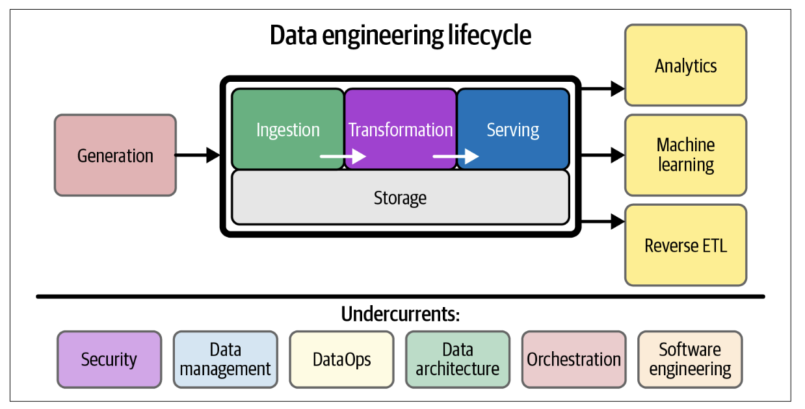

# What Is the Data Engineering Lifecycle?
The  data  engineering  lifecycle  comprises  stages  that  turn  raw  data  ingredients  into  a   useful end product, ready for consumption by analysts, data scientists, ML engineers,  and others.

The data engineering lifecycle is divided into five stages:

---

## **Generation**

The origin of raw data in the data engineering lifecycle.  

**Examples**: Transactional databases (RDBMS), Application message queues (e.g., Kafka), IoT devices or sensor swarms, Web/mobile apps, spreadsheets.

!!! tip
    **Key engineering considerations:**

    - What type is it? (App DB, IoT, etc.)
    - How is data stored? (Persistent or temporary)
    - How fast is data generated? (Events/sec or GB/hr)
    - Are there data quality issues? (Nulls, bad formats)
    - Can duplicates or late-arriving data occur?
    - What’s the schema structure? Does it evolve?
    - How often is data pulled? (Real-time, hourly?)
    - What’s the data update method? (Snapshot or CDC)
    - Who owns/provides the data?
    - Will reading from it affect app performance?
    - Are there upstream dependencies?  

---

## **Storage**

The place where data is kept during any stage of the lifecycle. Not just passive storage—modern systems can process and query data too. Storage impacts ingestion, transformation, and serving stages.

!!! warning
    **Why It’s Complex**

    - Multiple storage types are often used together (e.g., cloud storage + data warehouses).
    - Storage overlaps with other stages of the lifecycle (Kafka, S3, Snowflake).
    - Some systems support storage + compute together (e.g., cloud data warehouses).

!!! tip
    **Key Considerations When Choosing Storage**

    - **Performance:** Are read/write speeds sufficient for your architecture? Will it bottleneck downstream jobs?
    - **Fit for Purpose:** Are you misusing the storage (e.g., doing random writes in object storage)?
    - **Scalability:** Can it handle future data volume, query load, and write throughput?
    - **SLA Support:** Can it deliver data within required time frames for users and systems?
    - **Metadata & Governance:** Does it support schema evolution tracking, lineage, and data discovery?
    - **Capabilities:** Pure storage (e.g., S3) vs. compute + storage (e.g., BigQuery, Snowflake)?
    - **Schema flexibility:** Schema-less (S3), Flexible (Cassandra), Strict (Redshift, RDBMS)
    - **Compliance:** Can it support data sovereignty and regulatory needs (e.g., GDPR, HIPAA)?

| Type      | Description                            | Storage Tip                            |
|-----------|----------------------------------------|-----------------------------------------|
| **Hot**   | Frequently accessed (e.g., per second) | Store in fast-access systems (RAM, SSD) |
| **Warm**  | Accessed occasionally (weekly/monthly) | Moderate-speed, cost-efficient storage  |
| **Cold**  | Rarely accessed, kept for compliance   | Cheap storage, archival (e.g., Glacier) |

---

## **Ingestion**

Ingestion is the process of gathering data from source systems.  
It’s often a major bottleneck due to:

- Unreliable source systems
- Ingestion service failures
- Poor data quality or availability

!!! tip
    **Key Considerations When Ingesting data**

    - Can storage systems handle real-time load?
    - Do you need real-time or will micro-batch (e.g., every minute) suffice?
    - Does real-time ingestion add value (e.g., live decisions)?
    - Will streaming increase cost/complexity over batch?
    - Are streaming tools managed or self-hosted?
    - Does the ML model benefit from online predictions?

| Type      | Description                          | Use Cases                        |
|-----------|--------------------------------------|----------------------------------|
| **Batch** | Collects data in intervals or chunks | Analytics, ML training, reports  |
| **Streaming** | Processes data in real-time (low latency) | Real-time dashboards, alerts     |

---
## **Transformation**

The process of changing raw data into useful formats for analysis, reporting, or machine learning.  
This is where data starts creating business value.  
**Common early transformations**: type casting, format standardization, and error removal.  
**Later stages include**: aggregations, normalization, featurization (for ML), and schema changes.

| Type       | Description                                  | Example Use Cases                   |
|------------|----------------------------------------------|-------------------------------------|
| **Batch**  | Processed in chunks                          | Reporting, model training           |
| **Streaming (in-flight)** | Transformed as it flows through a stream | Real-time analytics, alerts         |

!!! Note
    **Where Does Transformation Occur?**

    - In source systems (e.g., app adds timestamp before ingestion)
    - During ingestion (e.g., enrich data in-stream)
    - Post-ingestion in data warehouses/lakehouses

    **Business Logic & Data Modeling:**

    - Business logic makes data actionable and understandable.
    - Example: Convert raw transactions to revenue using accounting logic.
    - Consistency in applying business rules is critical.

    **Featurization for ML:**

    - Extracting and engineering important features for model training.
    - Combines domain knowledge and data science.
    - Can be automated by data engineers in pipelines once defined.

---

## **Serving data**

Making transformed data available for practical use: analytics, dashboards, machine learning, or operational systems.  
Data has no value if it isn’t used or consumed.

**Use Cases for Data Serving**

1. Analytics

    - **Business Intelligence (BI):** Reporting on past and current trends using business logic.
    Logic-on-read is becoming more common (business rules applied during querying, not transformation).
    - **Self-Service Analytics:** Empowers non-technical users to explore data. Requires high data quality and organizational maturity.
    - **Operational Analytics:** Real-time dashboards (e.g., app health, live inventory). Consumed immediately to trigger action.
    - **Embedded Analytics:** Delivered to customers via apps (e.g., SaaS dashboards). Requires robust access control and multitenancy to prevent data leaks.

2. Machine Learning

    - **Feature Stores:** Systems that store and manage features for ML models.  
    - **Data Engineers may** Maintain Spark clusters, orchestrate pipelines, and monitor metadata. Collaborate closely with ML and analytics engineers.

    > ML maturity depends on solid data foundations—master analytics first.

3. Reverse ETL
    - Sends data back to source systems (e.g., CRMs, marketing platforms). Example: Push customer segments from a warehouse to Google Ads.

        **Challenges:**
        - Must maintain lineage, business logic, and security.
        - May be replaced by event-driven architectures, but remains practical today.
