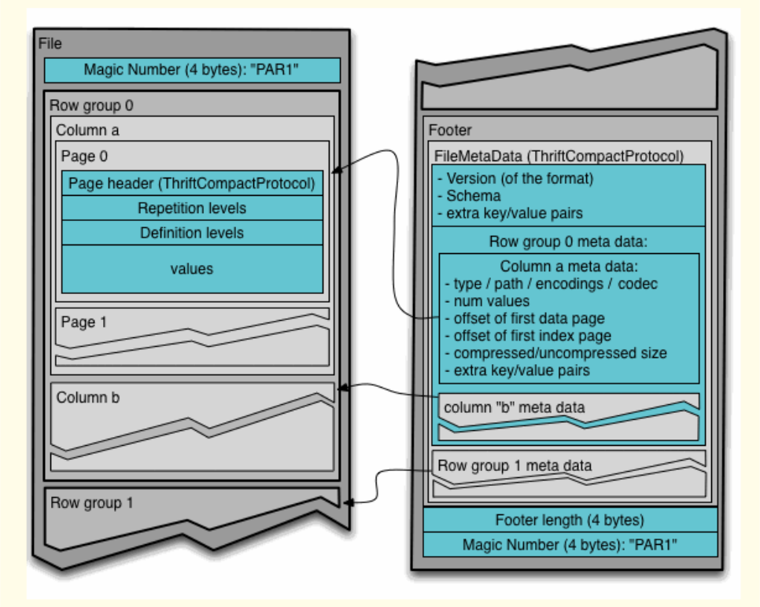
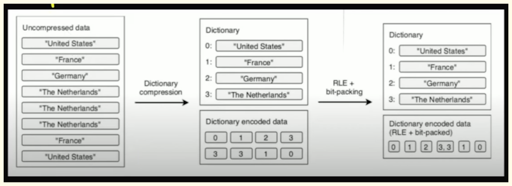

## **How data is stored physically on disk**

**Row-based File Formats (e.g., CSV, traditional databases for OLTP)**:

Data for an entire row is stored contiguously on disk.

Advantage for OLTP: When you need all the details of a specific record (e.g., a customer's entire banking transaction), a row-based format allows you to access all its columns continuously. If you need to update multiple columns for a single transaction, the data is already together.

Disadvantage for OLAP: If you only need a few columns (e.g., "Title" and "Chart") from a large dataset, a row-based system still has to read through all the interleaved data (including "Date") for every row. This leads to excessive I/O operations and slower performance because the system has to "jump" across the disk to pick out the desired columns from different rows.

**Column-based File Formats (e.g., Parquet for OLAP)**:

Data for each column is stored contiguously on disk, independent of other columns.

Advantage for OLAP: This format shines in "read-many" scenarios prevalent in Big Data analytics. If you only need "Title" and "Chart" columns, the system can go directly to the contiguous "Title" block and "Chart" block, skipping the "Date" column entirely. This significantly reduces I/O, leading to faster query performance and lower computational cost.

Disadvantage for OLTP: If you need to retrieve or update an entire row, the system has to jump between different column blocks to gather all the data for that single row

## **Parquet**
Columnar storage format, available to any project in the Hadoop ecosystem.
It's designed to bring efficient columnar storage of data compared to row-based like CSV or TSV files.

It is columnar in nature and designed to bring efficient columnar storage of data.
Provides efficient data compression and encoding schemes with enhanced performance to handle complex data in comparison to row-based files like CSV.

Schema evolution is handled in the file metadata allowing compatible schema evolution.
It supports all data types, including nested ones, and integrates well with flat data, semi-structured data, and nested data sources.

Parquet is considered a de-facto standard for storing data nowadays

Data compression – by applying various encoding and compression algorithms, Parquet file provides reduced memory consumption

Columnar storage – this is of paramount importance in analytic workloads, where fast data read operation is the key requirement. But, more on that later in the article…

Language agnostic – as already mentioned previously, developers may use different programming languages to manipulate the data in the Parquet file

Open-source format – meaning, you are not locked with a specific vendor

**Why is this additional structure super important?**
 
In OLAP scenarios, we are mainly concerned with two concepts: projection and predicate(s). Projection refers to a SELECT statement in SQL language – which columns are needed by the query. 

Predicate(s) refer to the WHERE clause in SQL language – which rows satisfy criteria defined in the query. In our case, we are interested in T-Shirts only, so the engine can completely skip scanning Row group 2, where all the values in the Product column equal socks!

This means, every Parquet file contains “data about data” – information such as minimum and maximum values in the specific column within the certain row group. Furthermore, every Parquet file contains a footer, which keeps the information about the format version, schema information, column metadata, and so on.

While Parquet is primarily columnar, it actually uses a hybrid model to combine the efficiencies of both row and column storage. This hierarchical structure helps manage very large datasets.

Let’s stop for a moment and understand above diagram, as this is exactly the structure of the Parquet file  Columns are still stored as separate units, but Parquet introduces additional structures, called Row group.

**The structure of a Parquet file can be visualized as a tree**

1. **File**: The top-level entity.
 It contains metadata about the entire file, such as the number of columns, total rows, and number of row groups.

2. **Row Group**: This is a logical horizontal partition of the data within the file.
 Instead of storing all data for a column as one huge block, Parquet breaks the data into smaller, manageable chunks called Row Groups.
 By default, a row group stores around 128 MB of data.
 For example, if you have 100 million records, a row group might contain 100,000 records.
 Each row group also contains metadata, including the minimum and maximum values for each column within that specific row group. This metadata is crucial for optimization.

3. **Column (Column Chunk)**: Inside each row group, data is organized by column.
 All the data for a specific column within that row group (e.g., all "Title" values for the first 100,000 records) is stored together contiguously.
4. **Page**: This is a further logical partition within a column chunk, where the actual data values are stored.
 Each page contains its own metadata, which includes information like the maximum and minimum values present on that page.

This hierarchical structure and the abundant metadata at different levels (file, row group, column, page) are what make Parquet highly efficient

**Metadata and its Role**

Parquet stores a rich set of metadata (data about data) internally. This metadata is a key factor in Parquet's performance advantages:

1. **File-level metadata**: Includes information like the total number of columns, total rows, and the number of row groups.
2. **Row Group-level metadata**: Crucially stores the minimum and maximum values for each column within that row group.
3. **Page-level metadata**: Also contains statistics like minimum and maximum values for data within that specific page.
Because of this extensive metadata, when a Parquet file is read, it doesn't need to be given additional parameters like schema information; it already contains all necessary details. This self-describing nature simplifies data processing.

**Encoding and Compression Techniques**
Parquet uses several intelligent encoding and compression techniques to reduce file size and improve query speed without losing information.

1. Encoding: These techniques transform data into a more compact format before compression.

    **Dictionary Encoding**:
  
    Used for columns with many repeating values (low cardinality), like "Destination Country Name" where there might be millions of records but only ~200 distinct countries.
    Parquet identifies the distinct values in a column and creates a dictionary (a mapping) where each distinct value is assigned a small integer code (e.g., 0 for "United States," 1 for "France," etc.).
    The actual data in the column is then stored as these compact integer codes instead of the full strings.
    When reading, Parquet uses the dictionary to convert the codes back to the original values. This drastically reduces storage space.

    **Run Length Encoding (RLE)**:
    
    Used for sequences of repeating values.
    Instead of storing "AAAAABBCD," RLE would store "A5B2C1D1" (A appears 5 times, B 2 times, etc.).
    This makes the data much smaller, especially for columns with many consecutive identical values.

    **Bit Packing**:
    
    Optimizes storage at the bit level.
    If a column's values (after dictionary encoding) only range from 0 to 3, these values can be stored using just 2 bits per value (00, 01, 10, 11) instead of the standard 8 bits (1 byte) or more.
    This significantly reduces the byte size required to store each value.

2. Compression: After encoding, Parquet applies compression algorithms to further reduce the file size.
 Common compression codecs include Gzip, Snappy, and LZ4.
 The choice of compression can impact performance. For example, Snappy is often much faster for reads than Gzip, even if Gzip provides slightly better compression ratios. The source states that a query running in 3000 seconds with Gzip might run in just 29 seconds with Snappy, making it 100 times faster

**Optimization Techniques in Parquet**

The combination of columnar storage, hierarchical structure, rich metadata, and intelligent encoding/compression enables two powerful optimization techniques.

1. **Predicate Pushdown (Filter Pushdown)**:
This technique uses the row group-level metadata (min/max values for each column) to skip scanning entire row groups that cannot possibly satisfy a query's filter condition.

    Example: Consider a query SELECT * FROM table WHERE age < 18.

    Parquet will first check the metadata of each row group.If a row group's metadata indicates that its age column has a minimum value of 22 and a maximum value of 35, Parquet immediately knows that this row group cannot contain any data where age < 18.
    
    Therefore, the system discards that entire row group without reading any of its data from disk. This saves significant I/O, CPU utilization, time, and cost.
    
    This optimization also works with equality checks (e.g., WHERE age = 18) by checking if 18 exists in the row group's dictionary (if dictionary encoding is used) or falls within its min/max range.

2. **Projection Pruning**:
This technique capitalizes on Parquet's columnar storage by only reading the columns that are explicitly required by the query.Example: If a query is SELECT name, age FROM users, Parquet will only read the name and age column data from disk and completely skip reading any other columns like address, phone_number, etc.. Since columns are stored separately, this is highly efficient as it avoids bringing unnecessary data into memory, reducing I/O and processing load