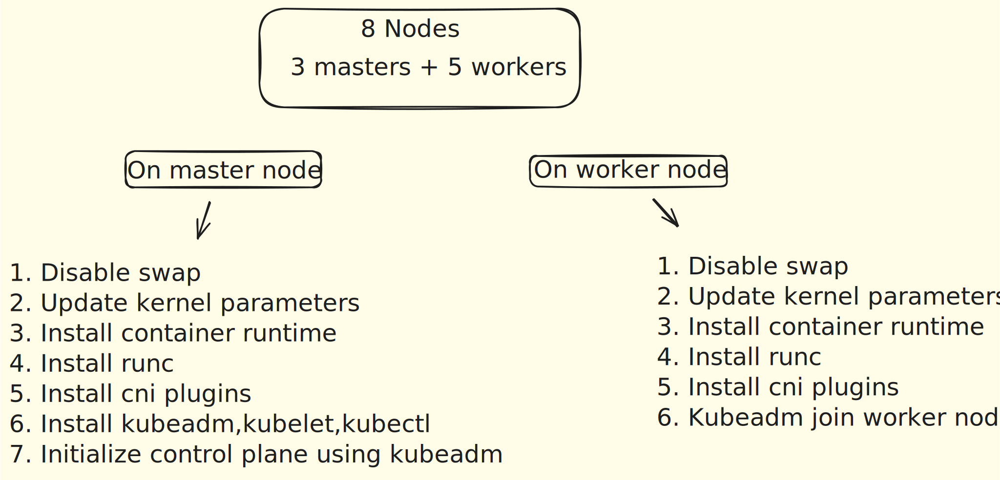

# Kubernetes Cluster Installation Guide



## Sanity Setup and Pre-requisites

???- "Perform Sanity Checks on All Hosts"
    ```bash
    # 1. Disable SELinux on all hosts.
    # 2. Docker user should have root access.
    # 3. Add host entries.
    # 4. Disable swap on all hosts.
    # 5. Enable passwordless SSH from docker user and root.
    ```

## Master Node Setup

???- "SSH into the Master Node"
    ```bash
    ssh user@master-node
    ```

???- "Disable Swap"
    ```bash
    swapoff -a
    sudo sed -i '/ swap / s/^\(.*\)$/#\1/g' /etc/fstab
    ```

???- "Configure Networking for Kubernetes"
    ```bash
    cat <<EOF | sudo tee /etc/modules-load.d/k8s.conf
    overlay
    br_netfilter
    EOF

    sudo modprobe overlay
    sudo modprobe br_netfilter

    cat <<EOF | sudo tee /etc/sysctl.d/k8s.conf
    net.bridge.bridge-nf-call-iptables  = 1
    net.bridge.bridge-nf-call-ip6tables = 1
    net.ipv4.ip_forward                 = 1
    EOF

    sudo sysctl --system
    lsmod | grep br_netfilter
    lsmod | grep overlay
    sysctl net.bridge.bridge-nf-call-iptables net.bridge.bridge-nf-call-ip6tables net.ipv4.ip_forward
    sysctl -p
    ```

???- "Install Container Runtime (containerd)"
    === "RPM-based Installation"
        ```bash
        yum install -y containerd-*.rpm
        ```
    === "Tar-based Installation"
        ```bash
        curl -LO https://github.com/containerd/containerd/releases/download/v1.7.14/containerd-1.7.14-linux-amd64.tar.gz
        sudo tar Cxzvf /usr/local containerd-1.7.14-linux-amd64.tar.gz
        curl -LO https://raw.githubusercontent.com/containerd/containerd/main/containerd.service
        sudo mkdir -p /usr/local/lib/systemd/system/
        sudo mv containerd.service /usr/local/lib/systemd/system/
        sudo mkdir -p /etc/containerd
        containerd config default | sudo tee /etc/containerd/config.toml
        sudo sed -i 's/SystemdCgroup \= false/SystemdCgroup \= true/g' /etc/containerd/config.toml
        ```

???- "Enable and Start containerd"
    ```bash
    sudo systemctl daemon-reload
    sudo systemctl enable --now containerd
    systemctl status containerd
    ```

???- "Install Runc"
    === "RPM-based Installation"
        ```bash
        yum install -y runc
        ```
    === "Tar-based Installation"
        ```bash
        curl -LO https://github.com/opencontainers/runc/releases/download/v1.1.12/runc.amd64
        sudo install -m 755 runc.amd64 /usr/local/sbin/runc
        ```

???- "Install CNI Plugin"
    ```bash
    curl -LO https://github.com/containernetworking/plugins/releases/download/v1.5.0/cni-plugins-linux-amd64-v1.5.0.tgz
    sudo mkdir -p /opt/cni/bin
    sudo tar Cxzvf /opt/cni/bin cni-plugins-linux-amd64-v1.5.0.tgz
    ```

???- "Install Kubernetes Components"
    ```bash
    # Download rpm from official kubernetes documentation
    yum install -y kube*.rpm
    kubeadm version
    kubelet --version
    kubectl version --client
    ```

???- "Configure crictl for Containerd"
    ```bash
    sudo crictl config runtime-endpoint unix:///var/run/containerd/containerd.sock
    ```

???- "Initialize Kubernetes Control Plane"
    ```bash
    # Load necessary Kubernetes images before initializing
    kubeadm config images list
    # Example images:
    # registry.k8s.io/kube-apiserver:v1.30.1
    # registry.k8s.io/kube-controller-manager:v1.30.1
    # registry.k8s.io/kube-scheduler:v1.30.1
    # registry.k8s.io/kube-proxy:v1.30.1
    # registry.k8s.io/coredns/coredns:v1.11.1
    # registry.k8s.io/pause:3.9
    # registry.k8s.io/etcd:3.5.12-0

    kubeadm init --kubernetes-version=v1.30.1 \
      --control-plane-endpoint "hostIP:6443" \
      --upload-certs \
      --pod-network-cidr=10.244.0.0/16 \
      --apiserver-advertise-address=hostIP
    ```

???- "Set Up kubeconfig for kubectl"
    ```bash
    mkdir -p $HOME/.kube
    sudo cp -i /etc/kubernetes/admin.conf $HOME/.kube/config
    sudo chown $(id -u):$(id -g) $HOME/.kube/config
    ```

???- "Install Calico for Networking"
    ```bash
    wget https://github.com/manish-chet/DataEngineering/blob/main/kubernetes/calico_edited.yaml
    kubectl apply -f calico_edited.yaml
    ```

## Worker Node Setup

???- "Repeat Master node Setup Steps and Join Cluster"
    ```bash
    # Repeat the above steps on all worker nodes, then join them to the cluster:
    sudo kubeadm join hostIP:6443 --token xxxxx --discovery-token-ca-cert-hash sha256:xxx
    ```
    If you need the join command again, run the following on the master node:
    ```bash
    kubeadm token create --print-join-command
    ```

## Validation

???- "Validate Cluster Status"
    ```bash
    kubectl get nodes
    kubectl get pods -A
    ```

## References
- [Official Kubernetes Documentation](https://kubernetes.io/docs/setup/production-environment/tools/kubeadm/install-kubeadm/)
- [Mirantis Kubernetes Guide](https://www.mirantis.com/blog/how-install-kubernetes-kubeadm/)
- [Containerd Setup Guide](https://github.com/containerd/containerd/blob/main/docs/getting-started.md)
- [Kubernetes Networking](https://kubernetes.io/docs/reference/networking/ports-and-protocols/)
- [Kubernetes Dashboard](https://github.com/skooner-k8s/skooner)
