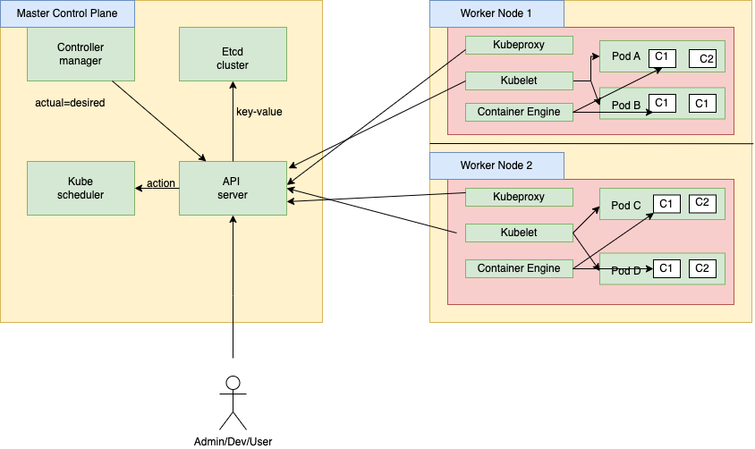

# Kubernetes Architecture Explained

The architecture diagram depicted in the video shows two basic components: Master and Worker (also referred to as Node). These can be considered nodes. In the example discussed, the diagram shows a master and two nodes, indicating the use of two EC2 instances for the lab. A node signifies a server that manages containers or pods. The master is the component that controls these nodes. This structure follows a client-server model, similar to systems like Chef. For a lab setup, three EC2 instances would be created, and one would be designated as the master.

The diagram also illustrates how users interact with the cluster. Users communicate with the cluster through the API Server. Users can create manifests, which are configuration files written in YAML or JSON format, similar to recipes in Chef. These manifests describe the desired state, such as creating a pod with a specific number of containers. The API Server reads the manifest, understands the desired state, and then communicates with the Controller Manager to initiate the process.

---

## Components of Control Plane

### 1. Kube API Server
This is described as the most important component, acting as the point of contact for all communication. All other components communicate through the API Server. User requests and requests from nodes always come to the API Server. It acts like a receptionist in a bank, receiving requests and forwarding them to the appropriate components; it doesn't solve the requests itself. Nodes communicate with the API Server, not directly with other master components. The Kubelet component on the nodes communicates with the API Server. It is meant to scale automatically as per load. It is the front end of the control plane.

### 2. ETCD
This is described as a database or storage, similar to Chef's data bag, which maintains the current state. It stores information about the cluster's state, including the number of containers in a pod, pod IP addresses, and other details. ETCD is an external component, not a fundamental part of Kubernetes itself, but Kubernetes cannot work without it. It acts as a ledger of all activities. Importantly, only the API Server can access ETCD directly; no other component like the Controller Manager or Scheduler can. It stores data as key-value pairs.

**ETCD has the following features:**

- Fully replicated – entire state is available on every node in the cluster
- Secure – implements automatic TLS with optional client certificate authentication
- Fast – benchmarked at 10,000 writes per second

### 3. Kube Scheduler
This component performs the actions to make the actual state equal to the desired state. If a pod should have four containers but only has three, the Controller Manager notes the mismatch and tells the Scheduler to create the additional container. The Scheduler is the one that actually performs the work, like creating pods. It decides on which node to create a pod based on factors like available resources.

### 4. Controller Manager
This component is responsible for maintaining the balance between the actual state and the desired state of the cluster. It ensures that the requested number of containers for a pod are available. Using a bank analogy, it's like the person who verifies a withdrawal request against the account balance before allowing the cashiers to dispense money. It guarantees that what was requested (desired state) matches what is actually running (actual state).

**Components on master that run controller:**
- **Node Controller:** For checking the cloud provider to determine if a node has been detected in the cloud after it stops responding
- **Route Controller:** Responsible for setting up network routes on your cloud
- **Service Controller:** Responsible for load balancer on your cloud against service of type `LoadBalancer`
- **Volume Controller:** For creating, attaching, and mounting volumes and interacting with cloud provider to orchestrate volumes

---

## Components of Worker Plane

The Worker Nodes are depicted separately from the Master. They are also referred to as workers or minions. A cluster can have one master and one node, one master and multiple nodes, or even multiple masters and multiple nodes.

Each Worker Node contains three basic components:

### 1. Kubelet
This is an agent that runs on each node. It communicates with the API Server and reports the state of the node. It receives requests from the API Server and is responsible for managing pods on the node. Its general task is to create and manage multiple pods. It reports the success or failure status back to the master. Uses port 10255.

### 2. Kube-Proxy
This component handles the networking for the pods on the node. Its basic job is to assign IP addresses to pods. It runs on each node and ensures that each pod gets its own unique IP address.

### 3. Container Engine
This is the software that runs the containers. It is recommended to refer to it as a "Container Engine" rather than specifically "Docker," as Kubernetes can work with various container engines like Docker, Rkt, or Containerd. The Container Engine is not a part of Kubernetes itself; it needs to be installed on each node. It works with the Kubelet to pull images, create and run containers, and expose containers on specified ports.

---

## Pod

The diagram also features Pods as the basic unit within the nodes. A Pod is the smallest or atomic unit in Kubernetes. While direct containers can be created with a container engine like Docker, Kubernetes introduces the concept of Pods as a logical unit. Kubernetes talks to Pods, not directly to containers. A Pod is a logical envelope or wrapper for containers. It typically contains one or more containers. In Kubernetes, the control unit is called a Pod, not containers.
