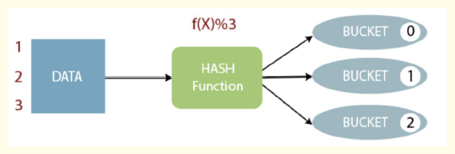

### **Partitioning in Hive**

Apache Hive organizes tables into partitions. Partitioning is a way of dividing a table into related parts based on the values of particular columns like date, city, and department.

Each table in the hive can have one or more partition keys to identify a particular partition. Using partition it is easy to do queries on slices of the data.

  

Why is partitioning important?

1. Speeds Up Data Query: Partitioning reduces data search space for queries, speeding up data retrieval.
2. Reduces I/O Operations: Only relevant data partitions are scanned, reducing unnecessary I/O operations.
3. Improves Query Performance: By limiting data read, partitioning boosts query performance.
4. Saves Resources: Querying only relevant partitions uses fewer computational resources.
5. Manages Large Data Sets: Helps handle large datasets by dividing them into smaller, manageable parts.
6. Filter Data Efficiently: Speeds up queries that commonly filter by certain columns.
7. Enables Scalability: As data grows, new partitions can be added without degradation in performance.
8. Data Management and Archiving: Makes it easier to archive or delete data based on time or other attributes.

#### **Types of Partitioning**

##### **Static Partitioning**

1. Insert input data files individually into a partition table is Static Partition.
2. Usually when loading files (big files) into Hive tables static partitions are preferred.
3. Static Partition saves your time in loading data compared to dynamic partition.
4. You “statically” add a partition in the table and move the file into the partition of the table.
5. We can alter the partition in the static partition.
6. Static partition is the default partition strategy in hive
7. Static partition is in Strict Mode.
8. You should use where clause to use limit in the static partition.
9. You can perform Static partition on Hive Manage table or External table.

!!! note "Note" 
     
     Syntax to load data in Static Partitioned Table

     LOAD DATA INPATH '/hdfs/path/to/datafile' INTO TABLE employees PARTITION (year='2023');

     OR
    
     INSERT OVERWRITE TABLE employees PARTITION (year='2023') SELECT name, age FROM emp_data WHERE year = '2023';

##### **Dynamic Partitioning**

1. Single insert to partition table is known as a dynamic partition.
2. Usually, dynamic partition loads the data from the non-partitioned table.
3. Dynamic Partition takes more time in loading data compared to static partition.
4. When you have large data stored in a table then the Dynamic partition is suitable.
5. If you want to partition a number of columns but you don’t know how many columns then also dynamic partition is suitable.
6. Dynamic partition there is no required where clause to use limit.
7. We can’t perform alter on the Dynamic partition.
8. You can perform dynamic partition on hive external table and managed table.
9. If you want to use the Dynamic partition in the hive then the mode is in non-strict mode.
    SET hive.exec.dynamic.partition = true;
    SET hive.exec.dynamic.partition.mode = nonstrict;

!!! note "Note"
      Syntax to load data in Dynamic Partitioned Table

     INSERT OVERWRITE TABLE employees PARTITION (year) SELECT name, age, year FROM emp_data

### **Bucketing in Hive**

  

You’ve seen that partitioning gives results by segregating HIVE table data into multiple files only when there is a limited number of partitions, what if partitioning the tables results in a large number of partitions. This is where the concept of bucketing comes in.
When a column has a high cardinality, we can’t perform partitioning on it. A very high number of partitions will generate too many Hadoop files which would increase the load on the node. That’s because the node will have to keep the metadata of every partition, and that would affect the performance of that node
In simple words, You can use bucketing if you need to run queries on columns that have huge data, which makes it difficult to create partitions.

1. The concept of bucketing is based on the hashing technique.
2. modules of current column value and the number of required buckets is calculated (let say, F(x) % 3).
3. Based on the resulted value, the data stored into the corresponding bucket.
4. The Records with the same bucketed column stored in the same bucket
5. This function requires you to use the Clustered By clause to divide a table into buckets.

 

### **Difference between Partitioning and Bucketing**

 

Partitioning and bucketing are not dependent on each other, but they can be used together to improve query performance and data management. They serve different purposes and can coexist to complement each other. 

Using partitioning and bucketing together allows Hive to prune data at the partition level and further organize data within a partition by distributing it into buckets.

### **Benefits of partitioning**

1. Filtering: If queries often filter data based on a certain column, partitioning on that column can significantly reduce the amount of data read, thus improving performance. For example, if a table is partitioned by date and queries frequently request data from a specific date, partitioning can speed up these queries.
2. Aggregation: If you're aggregating data based on the partition column, partitioning can optimize these operations by reducing the amount of data Hive needs to read.
3. Data Management: Partitioning helps manage and organize data better. It can be useful for removing or archiving data efficiently. For example, you can quickly drop a partition to delete data for a specific date. 

### **Benefits of bucketing**

1. Sampling: Bucketing allows efficient sampling of data. Since each bucket essentially represents a sample of data, you can quickly get a sample by querying a single bucket.
2. Join Operations: Bucketing can be used to perform more efficient map-side joins when joining on the bucketed column. If two tables are bucketed on the join columns and are of similar size, Hive can perform a bucketed map join, which is much faster than a regular join.
3. Handling Skew: If data is skewed (i.e., some values appear very frequently), bucketing can distribute the data more evenly across files, improving query performance.

