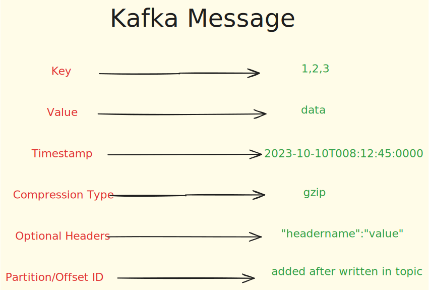

## **Kafka Architecture**

##**Message**
A message is a primary unit of data within Kafka. Messages sent from a producer consist of the following parts:

*Message Key (optional)*: Keys are commonly used when ordering or grouping related data. For example, in a log processing system, we can use the user ID as the key to ensure that all log messages for a specific user are processed in the order they were generated.

*Message Value*: It contains the actual data we want to transmit. Kafka does not interpret the content of the value. It is received and sent as it is. It can be XML, JSON, String, or anything. Kafka does not care and stores everything. Many Kafka developers favor using Apache Avro, a serialization framework initially developed for Hadoop.

*Timestamp (Optional)*: We can include an optional timestamp in a message indicating its creation timestamp. It is useful for tracking when events occurred, especially in scenarios where event time is important.

*Compression Type (Optional)*: Kafka messages are generally small in size, and sent in a standard data format, such as JSON, Avro, or Protobuf. Additionally, we can further compress them into gzip, lz4, snappy or zstd formats.

*Headers (Optional)*: Kafka allows adding headers that may contain additional meta-information related to the message.

*Partition and Offset Id*: Once a message is sent into a Kafka topic, it also receives a partition number and offset id that is stored within the message.

## **Kafka Cluster** 
A Kafka cluster is a system of multiple interconnected Kafka brokers (servers). These brokers cooperatively handle data distribution and ensure fault tolerance, thereby enabling efficient data processing and reliable storage.
## **Kafka Broker** 
A Kafka broker is a server in the Apache Kafka distributed system that stores and manages the data (messages). It handles requests from producers to write data, and from consumers to read data. Multiple brokers together form a Kafka cluster.
## **Kafka Zookeeper**
Apache ZooKeeper is a service used by Kafka for cluster coordination, failover handling, and metadata management. It keeps Kafka brokers in sync, manages topic and partition information, and aids in broker failure recovery and leader election.
## **Kafka Producer**
In Apache Kafka, a producer is an application that sends messages to Kafka topics. It handles message partitioning based on specified keys, serializes data into bytes for storage, and can receive acknowledgments upon successful message delivery. Producers also feature automatic retry mechanisms and error handling capabilities for robust data transmission.
## **Kafka Consumer**
A Kafka consumer is an application that reads (or consumes) messages from Kafka topics. It can subscribe to one or more topics, deserializes the received byte data into a usable format, and has the capability to track its offset (the messages it has read) to manage the reading position within each partition. It can also be part of a consumer group to share the workload of reading messages.

