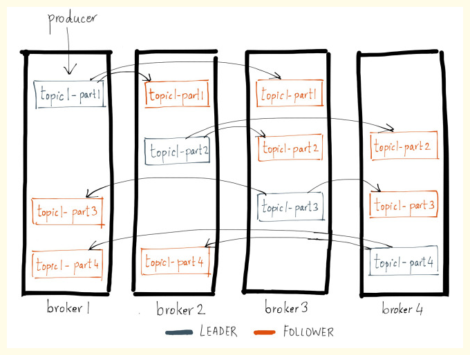
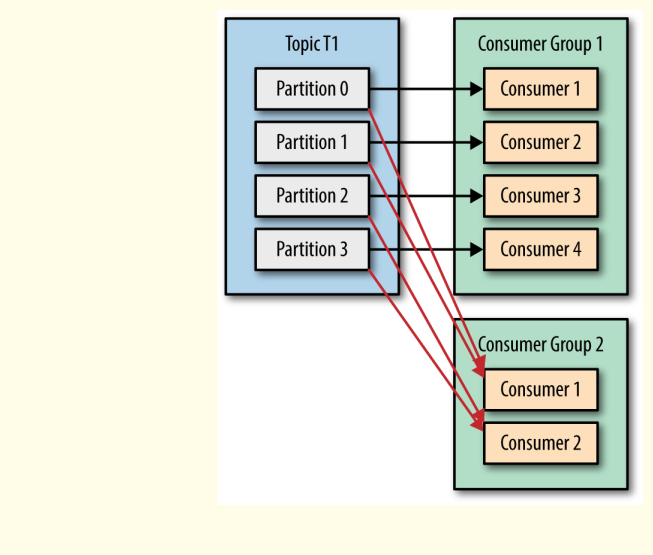

###  Topics

A topic is a stream of messages belonging to a particular category.
It acts as a logical feed where all batch records (messages) are published.
Each topic has a unique identifier to distinguish it.
Illustrative Example: In a news application, you might have topics like sports_news, finance_updates, or weather_alerts. All messages related to sports news would go into the sports_news topic.

###  Partitions

Topics are split into partitions.
All messages within a specific partition are ordered and immutable (meaning they cannot be changed after being written).
Each message within a partition has a unique ID called an Offset. This offset denotes the message's position within that specific partition.
Illustrative Example: If your sports_news topic has three partitions (P0, P1, P2), articles related to football might go to P0, basketball to P1, and tennis to P2. Within P0, all football articles will appear in the exact order they were published, each with its unique offset.

###  Replication

Replicas are essentially backups of partitions.
They are not directly read as raw data.
Their primary purpose is to prevent data loss and provide fault tolerance. If the server hosting an active partition fails, a replica can take over.
Illustrative Example: If the server hosting Partition P0 of sports_news crashes, a replica of P0 on another server immediately takes over, ensuring that no sports news articles are lost and the news feed remains continuous.

###  Producers

Producers are applications that write or publish data to the topics within a Kafka cluster .
They use the Producer API to send data .
Producers can choose to write data either at the topic level (letting Kafka distribute it across partitions) or to specific partitions of a topic.

Illustrative Example: A journalist writing a new article would be a producer, publishing the article to the news topic.

Partitions play a crucial role in Kafka's functionality and scalability. 

1. Parallelism: Partitions enable parallelism. Since each partition can be placed on a separate machine (broker), a topic can handle an amount of data that exceeds a single server's capacity. This allows producers and consumers to read and write data to a topic concurrently, thus increasing throughput.

2. Ordering: Kafka guarantees that messages within a single partition will be kept in the exact order they were produced. However, if order is important across partitions, additional design considerations are needed.

3. Replication: Partitions of a topic can be replicated across multiple brokers based on the topic's replication factor. This increases data reliability and availability.

4. Failover: In case of a broker failure, the leadership of the partitions owned by that broker will be automatically taken over by another broker, which has the replica of these partitions.

5. Consumer Groups: Each partition can be consumed by one consumer within a consumer group at a time. If more than one consumer is needed to read data from a topic simultaneously, the topic needs to have more than one partition.

6. Offset: Every message in a partition is assigned a unique (per partition) and sequential ID called an offset. Consumers use this offset to keep track of their position in the partition.

###  Consumers

Consumers are applications that read or consume data from the topics using the Consumer API .
Consumers can read data from the topic level (accessing all partitions of a topic) or from specific partitions .
Consumers are always associated with a consumer group .

Illustrative Example: A mobile news app that displays articles to users would be a consumer. If it's configured to show "sports news," it consumes messages from the sports_news topic.
    
#### How Consumers in Consumer Group read messages?

1. A single Kafka consumer can read from all partitions of a topic. This is often the case when you have only one consumer in a consumer group. 
2. However, when you have multiple consumers in a consumer group, the partitions of a topic are divided among the consumers. This allows Kafka to distribute the data across the consumers, enabling concurrent data processing and improving overall throughput.
3. It's also important to note that while a single consumer can read from multiple partitions, a single partition can only be read by one consumer from a specific consumer group at a time. This ensures that the order of the messages in the partition is maintained when being processed.

Consumer Groups

A consumer group is a group of related consumers that perform a task .
Each message in a partition is consumed by only one consumer within a consumer group, ensuring load balancing and avoiding duplicate processing within that group. Multiple groups can consume the same message.

Illustrative Example: You might have a "mobile app news feed" consumer group and a "website news archive" consumer group. Both groups consume the same news articles, but within the "mobile app" group, if there are multiple instances of the app running, they will share the load of processing new articles.

 Consumer groups in Apache Kafka have several key advantages:

1. Load Balancing: Consumer groups allow the messages from a topic's partitions to be divided among multiple consumers in the group. This effectively balances the load and allows for higher throughput.
2. Fault Tolerance: If a consumer in a group fails, the partitions it was consuming from are automatically reassigned to other consumers in the group, ensuring no messages are lost or left unprocessed.
3. Scalability: You can increase the processing speed by simply adding more consumers to a group. This makes it easy to scale your application according to the workload.
4. Parallelism: Since each consumer in a group reads from a unique set of partitions, messages can be processed in parallel, improving the overall speed and efficiency of data processing.
5. Ordering Guarantee: Within each partition, messages are consumed in order. As a single partition is consumed by only one consumer in the group, this preserves the order of messages as they were written into the partition.

###  Zookeeper

Zookeeper is a critical component used to monitor Kafka clusters and coordinate with them .
It stores all the metadata information related to Kafka clusters, including the status of replicas and leaders .
This metadata is crucial for configuration information, cluster health, and leader election within the cluster .
Zookeeper nodes working together to manage distributed systems are known as a Zookeeper Cluster or Zookeeper Ensemble .
Illustrative Example: If a Kafka server hosting a partition's leader fails, Zookeeper quickly identifies this and coordinates the election of a new leader from the available replicas, ensuring continuous operation.
