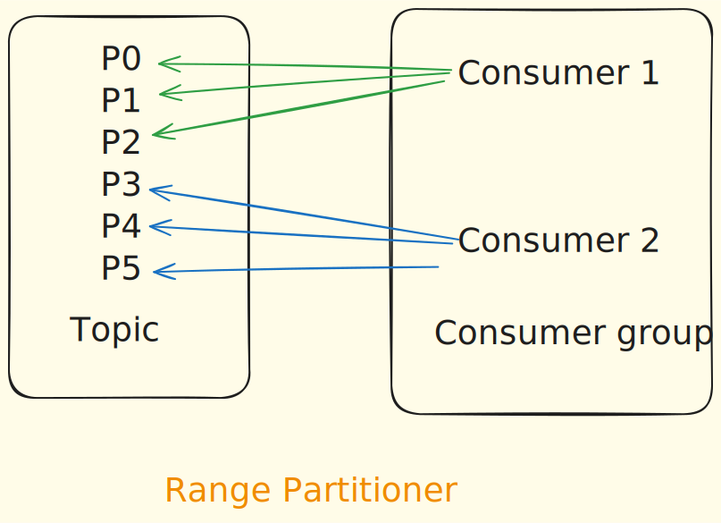
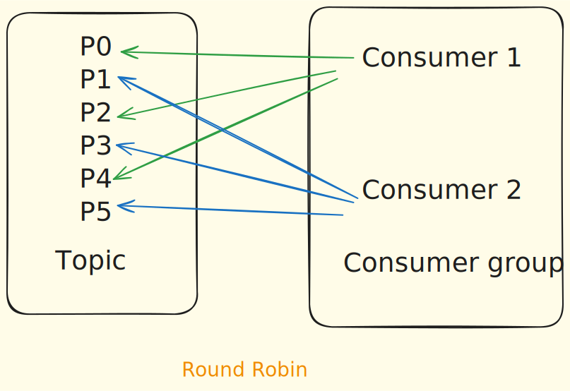

##  **Partitions**

Topics are split into partitions.
All messages within a specific partition are ordered and immutable (meaning they cannot be changed after being written).
Each message within a partition has a unique ID called an Offset. This offset denotes the message's position within that specific partition.

*Illustrative Example*: If your sports_news topic has three partitions (P0, P1, P2), articles related to football might go to P0, basketball to P1, and tennis to P2. Within P0, all football articles will appear in the exact order they were published, each with its unique offset.

Partitions play a crucial role in Kafka's functionality and scalability. 

1. **Parallelism**: Partitions enable parallelism. Since each partition can be placed on a separate machine (broker), a topic can handle an amount of data that exceeds a single server's capacity. This allows producers and consumers to read and write data to a topic concurrently, thus increasing throughput.

2. **Ordering**: Kafka guarantees that messages within a single partition will be kept in the exact order they were produced. However, if order is important across partitions, additional design considerations are needed.

3. **Replication**: Partitions of a topic can be replicated across multiple brokers based on the topic's replication factor. This increases data reliability and availability.

4. **Failover**: In case of a broker failure, the leadership of the partitions owned by that broker will be automatically taken over by another broker, which has the replica of these partitions.

5. **Consumer Groups**: Each partition can be consumed by one consumer within a consumer group at a time. If more than one consumer is needed to read data from a topic simultaneously, the topic needs to have more than one partition.

6. **Offset**: Every message in a partition is assigned a unique (per partition) and sequential ID called an offset. Consumers use this offset to keep track of their position in the partition.

## **Kafka Partition Assignment Strategies**

When rebalancing happens, Kafka uses specific algorithms to determine how partitions are assigned to consumers.

**Range Partitioner**: The Range Partitioner assigns a contiguous "range" of partitions to each consumer. It sorts partitions numerically (e.g., 0, 1, 2, 3, 4, 5).It then divides the total number of partitions by the number of consumers to determine the number of partitions each consumer should handle. A contiguous block of partitions (a "range") is assigned to each consumer.

*Example*:
Suppose a topic has 6 partitions (0, 1, 2, 3, 4, 5) and there are 2 consumers in the group.
   Consumer 1 would be assigned partitions 0, 1, 2 (a range of three partitions).
   Consumer 2 would be assigned partitions 3, 4, 5 (the next range of three partitions).

This strategy ensures a relatively uniform distribution of the number of partitions per consumer, though not necessarily the load if data is skewed across partitions.

**Round Robin Partitioner**

The Round Robin Partitioner distributes partitions among consumers in a rotating, round-robin fashion.
   It iterates through the sorted list of partitions (0, 1, 2, 3, 4, 5).
   It assigns the first partition to Consumer 1, the second to Consumer 2, the third back to Consumer 1, and so on.

*Example*:
Suppose a topic has 6 partitions (0, 1, 2, 3, 4, 5) and there are 2 consumers in the group.
   Consumer 1 would be assigned partitions 0, 2, 4.
   Consumer 2 would be assigned partitions 1, 3, 5.

This strategy aims for a more even distribution of partitions, which can sometimes lead to better load balancing if the message load per partition is relatively uniform.

## **Kafka Cluster & Partition Reassignment**

1. **Kafka Cluster Controller**: In a Kafka cluster, one of the brokers is designated as the controller. This controller is responsible for managing the states of partitions and replicas and for performing administrative tasks such as reassigning partitions.
2. **Partition Growth**: It is important to note that the partition count of a Kafka topic can always be increased, but never decreased. This is because reducing partitions could lead to data loss.
3. **Partition Reassignment Use Cases**: Partition reassignment is used in several scenarios:
       Moving a partition across different brokers.
       Rebalancing the replicas of a partition to a specific set of brokers.
       Increasing the replication factor of a topic.

##  **Replications**

Replicas are essentially backups of partitions.
They are not directly read as raw data.
Their primary purpose is to prevent data loss and provide fault tolerance. If the server hosting an active partition fails, a replica can take over.

*Illustrative Example*: If the server hosting Partition P0 of sports_news crashes, a replica of P0 on another server immediately takes over, ensuring that no sports news articles are lost and the news feed remains continuous.

One broker is marked leader and other brokers are called followers for a specific partition. This designated broker assumes the role of the leader for the topic partition. On the other hand, any additional broker that keeps track of the leader partition is called a follower and it stores replicated data for that partition.

!!! Tip
    Note that the leader receives and serves all incoming messages from producers and serves them to consumers. Followers do not serve read or write requests directly from producers or consumers. Followers just act as backups and can take over as the leader in case the current leader fails.

Therefore, each partition has one leader and multiple followers.

## **In-Sync Replicas (ISR)**
When a partition is replicated across multiple brokers, not all replicas are necessarily in sync with the leader at all times. The in-sync replicas represent the number of replicas that are always up-to-date and synchronized with the partition’s leader. The leader continuously sends messages to the in-sync replicas, and they acknowledge the receipt of those messages.

The recommended value for ISR is always greater than 1.

!!! Tip
    The ideal value of ISR is equal to the replication factor.