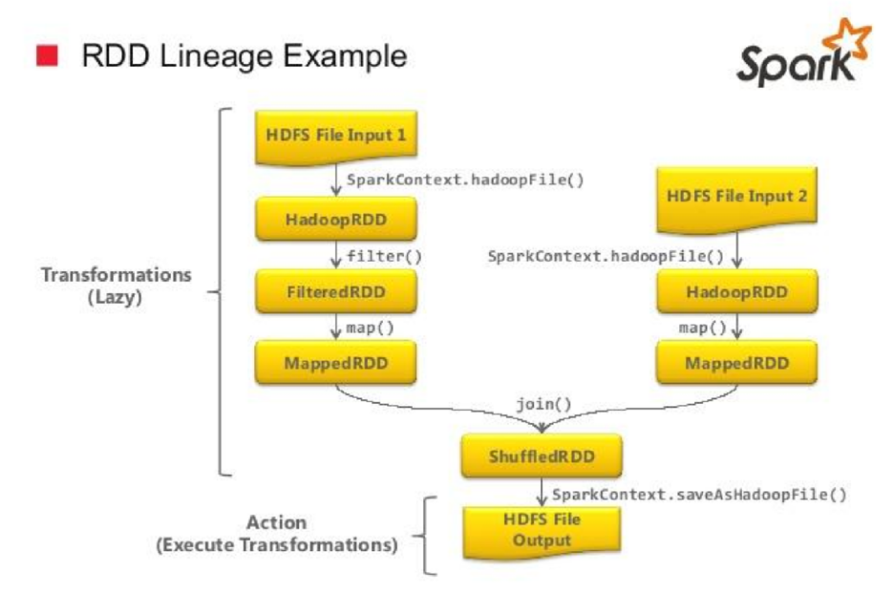

Spark represents a sequence of transformations on data as a DAG, a concept borrowed from mathematics and computer science. A DAG is a directed graph with no cycles, and it represents a finite set of transformations on data with multiple stages. The nodes of the graph represent the RDDs or DataFrames/Datasets, and the edges represent the transformations or operations applied.

Each action on an RDD (or DataFrame/Dataset) triggers the creation of a new DAG. The DAG is optimized by the Catalyst optimizer (in case of DataFrame/Dataset) and then it is sent to the DAG scheduler, which splits the graph into stages of tasks.


### Job, Stage and Task in Spark

1. Job: A job in Spark represents a single action (like count, collect, save, etc.) from a Spark application. When an action is called on a DataFrame or RDD in the program, a job is created. A job is a full program from start to finish, including reading the initial data, performing transformations, and executing actions. A Spark application can consist of multiple jobs, and each job is independent of the others.
2. Stage: A stage in Spark is a sequence of transformations on an RDD or DataFrame/Dataset that can be performed in a single pass (i.e., without shuffling data around). Spark splits the computation of a job into a series of stages, separated by shuffle boundaries. Each stage represents a sequence of transformations that can be done in a single scan of the data. In essence, a stage is a step in the physical execution plan.
3. Task: Within each stage, the data is further divided into partitions, and each partition is processed in parallel. A task in Spark corresponds to a single unit of work sent to one executor. So, if you have two stages with two partitions each, Spark will generate four tasks in total - one task per partition per stage. Each task works on a different subset of the data, and the tasks within a stage can be run in parallel.

Example:

    ```bash
    from pyspark.sql import SparkSession
    # Initialize Spark
    spark = SparkSession.builder.appName("PySpark Application").getOrCreate()
    # Read CSV files
    employees = spark.read.csv('employees.csv', inferSchema=True, header=True) 
    departments = spark.read.csv('departments.csv', inferSchema=True, header=True)
    regions = spark.read.csv('regions.csv', inferSchema=True, header=True) # Adding a third DataFrame
    # Narrow transformation: Filter 
    filtered_employees = employees.filter(employees.age > 30)
    # Wide transformation: Join 
    result = filtered_employees.join(departments, filtered_employees.dept_id == departments.dept_id)
    # Another wide transformation: Join with regions 
    result_with_regions = result.join(regions, result.region_id == regions.region_id)
    # Action: Collect 
    result_list = result_with_regions.collect()
    # Narrow transformation: Select a few columns 
    selected_data = result_with_regions.select('employee_name', 'department_name', 'region_name')
    # Action: Save as CSV 
    selected_data.write.csv('result.csv')
    # Stop Spark 
    spark.stop()
    ```
The jobs and their associated stages in the PySpark script example would be as follows:

Job 0 & 1: To read employees csv data and infer schema part

Job 2 & 3: To read departments csv data and infer schema part 

Job 4 & 5: To read regions csv data and infer schema part

Job 6: Triggered by the collect() action. This job consists of three stages:

 1. Stage 0: Filter transformation on 'employees' DataFrame.
 2. Stage 1: Join transformation between 'filtered_employees' and 'departments' DataFrames.
 3. Stage 2: Join transformation between 'result' and 'regions' DataFrames.

Job 7: Triggered by the write.csv() action. This job consists of one stage: The select() transformation and the write.csv() action do not require a shuffle and therefore do not trigger a new stage within Job 1.


### What if our cluster capacity is less than the size of data to be processed?
If your cluster memory capacity is less than the size of the data to be processed, Spark can still handle it by leveraging its ability to perform computations on disk and spilling data from memory to disk when necessary.

Let's break down how Spark will handle a 60 GB data load with a 30 GB memory cluster:
1. Data Partitioning: When Spark reads a 60 GB file from HDFS, it partitions the data into manageable blocks, according to the Hadoop configuration parameter dfs.blocksize or manually specified partitions. These partitions can be processed independently.
2. Loading Data into Memory: Spark will load as many partitions as it can fit into memory. It starts processing these partitions. The size of these partitions is much smaller than the total size of your data (60 GB), allowing Spark to work within the confines of your total memory capacity (30 GB in this case).
3. Spill to Disk: When the memory is full, and Spark needs to load new partitions for processing, it uses a mechanism called "spilling" to free up memory. Spilling means writing data to disk. The spilled data is the intermediate data generated during shuffling operations, which needs to be stored for further stages.
4. On-Disk Computation: Spark has the capability to perform computations on data that is stored on disk, not just in memory. Although computations on disk are slower than in memory, it allows Spark to handle datasets that are larger than the total memory capacity.
5. Sequential Processing: The stages of the job are processed sequentially, meaning Spark doesn't need to load the entire dataset into memory at once. Only the data required for the current stage needs to be in memory or disk.

