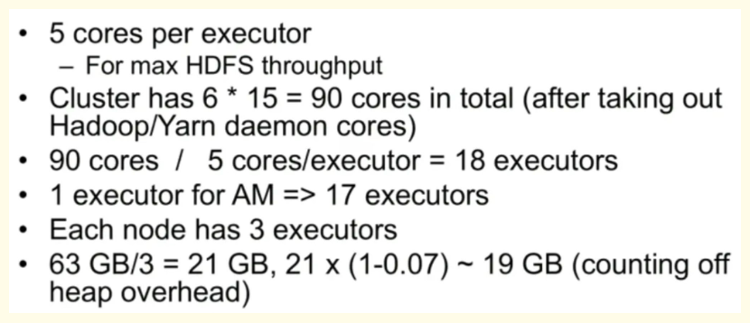

### Understand Your Data and Workload

1. Data Size: Understand the volume of data your application will process. This will influence the infrastructure needed and the parallelism level in your application.

2. Data Skewness: Identify if your data is skewed, as this can cause certain tasks to take longer to complete and negatively impact performance. Techniques like key salting can be applied to handle skewness.

3. Workload Type: Understand the type of operations your application will perform. For example, analytical workloads may benefit from columnar data formats like Parquet.

### Application Design

1. Transformations: Use transformations like map, filter, reduceByKey over actions as much as possible, as transformations are lazily evaluated and can benefit from Spark's optimization.

2. Shuffling: Minimize operations that cause data shuffling across the network, as they are expensive. Avoid operations like groupByKey in favor of reduceByKey or aggregateByKey.

3. Broadcasting: Small datasets that are used across transformations should be broadcasted to improve performance.

4. Partitioning: Use the right level of partitioning. Too few partitions can lead to fewer concurrent tasks and underutilization of resources. Too many partitions might lead to excessive overhead

### Resource Allocation and Configuration

1. Memory Allocation: Properly allocate memory to Spark executors, driver, and overhead. Monitor the memory usage of your application to fine-tune these settings.

2. Dynamic Resource Allocation: Enable dynamic resource allocation if supported by your cluster manager. This allows Spark to adjust the resources based on workload.

3. Parallelism: Configure the level of parallelism (number of partitions) based on the data volume and infrastructure.
Infrastructure Consideration:

4. Storage: Use fast storage (like SSDs) to store your data, as I/O operations can become a bottleneck in large data processing.

5. Network: A high-speed network is important, especially if your workload involves data shuffling.

6. Nodes and Cores: More nodes with multiple cores can increase parallelism and data processing speed.

7. Data Locality: Aim for data locality, i.e., running tasks on nodes where the data is stored, to reduce network I/O

### Monitor and Iterate
Use Spark's built-in web UI to monitor your applications. Look for stages that take a long time to complete, tasks that fail and are retried, storage and computation bottlenecks, and executor memory usage.

Data skewness in Spark occurs when the data is not evenly distributed across partitions. This often happens when certain keys in your data have many more values than others. Consequently, tasks associated with these keys take much longer to run than others, which can lead to inefficient resource utilization and longer overall job execution time.

Here are a few scenarios where data skewness can occur:

1. Join Operations: When you perform a join operation on two datasets based on a key, and some keys have significantly more values than others, these keys end up having larger partitions. The tasks processing these larger partitions will take longer to complete.

2. GroupBy Operations: Similar to join operations, when you perform a groupByKey or reduceByKey operation, and some keys have many more values than others, data skewness can occur.

3. Data Distribution: If the data distribution is not uniform, such that certain partitions get more data than others, then data skewness can occur. This could happen due to the nature of the data itself or the partitioning function not distributing the data evenly.

### How to deal with data skewness 
Handling data skewness is a common challenge in distributed computing frameworks like Apache Spark. Here are some popular techniques to mitigate it:
1. Salting: Salting involves adding a random component to a skewed key to create additional unique keys. After performing the operation (like a join), the extra key can be dropped to get back to the original data.

2. Splitting skewed data: Identify the skewed keys and process them separately. For instance, you can filter out the skewed keys and perform a separate operation on them.

3. Increasing the number of partitions: Increasing the number of partitions can distribute the data more evenly. However, this might increase the overhead of managing more partitions.

4. Using reduceByKey instead of groupByKey: reduceByKey performs local aggregation before shuffling the data, which reduces the data transferred over the network.

5. Using Broadcast Variables: When joining a large DataFrame with a small DataFrame, you can use broadcast variables to send a copy of the small DataFrame to all nodes. This avoids shuffling of the large DataFrame.

Total blocks - 128MB default block size (HDFS) - 1TB -> 1 *1024 1024/128 = 8192.

Let us take:

 1. 20 Executor-machine
 2. 5 Core processor in each executor node
 3. 6 GB RAM in each executor node

And the cluster can perform (20*5=100) Task parallel at a time, Here tasks mean block so 100 blocks can be processed parallelly at a time.

100*128MB = 12800 MB / 1024GB = 12.5 GB (So, 12GB data will get processed in 1st set of a batch)

Since the RAM size is 6GB in each executor, (20 executor x 6GB RAM =120GB Total RAM) So, at a time 12GB of RAM will occupy in a cluster (12gb/20node=0.6GB RAM In each executor).

Now, Available RAM in each executor will be (6GB - 0.6GB = 5.4GB) RAM which will be reserved for other users' jobs and programs.

So, 1TB = 1024 GB / 12GB = (Whole data will get processed in around 85 batches).

Note :- Actual values may differ in comparison with real-time scenarios.

### Case 1 Hardware — 6 Nodes and each node have 16 cores, 64 GB RAM

We start with how to choose the number of cores:

Number of cores = Concurrent tasks an executor can run

So we might think, more concurrent tasks for each executor will give better performance. But research shows that any application with more than 5 concurrent tasks, would lead to a bad show. So the optimal value is 5.

This number comes from the ability of an executor to run parallel tasks and not from how many cores a system has. So the number 5 stays the same even if we have double (32) cores in the CPU
 

Number of executors:
Coming to the next step, with 5 as cores per executor, and 15 as total available cores in one node (CPU) — we come to 3 executors per node which is 15/5. We need to calculate the number of executors on each node and then get the total number for the job.

So with 6 nodes and 3 executors per node — we get a total of 18 executors. Out of 18, we need 1 executor (java process) for Application 
Master in YARN. So the final number is 17 executors. This 17 is the number we give to spark using –num-executors while running from the spark-submit shell command.

Memory for each executor:

From the above step, we have 3 executors per node. And available RAM on each node is 63 GB

So memory for each executor in each node is 63/3 = 21GB.

However small overhead memory is also needed to determine the full memory request to YARN for each executor.

The formula for that overhead is max(384, .07 * spark.executor.memory) , Calculating that overhead: .07 * 21 (Here 21 is calculated as above  63/3) = 1.47

Since 1.47 GB > 384 MB, the overhead is 1.47

Take the above from each 21 above => 21–1.47 ~ 19 GB , So executor memory — 19 GB

**Final numbers — Executors — 17, Cores 5, Executor Memory — 19 GB**

### Case 2 Hardware — 6 Nodes and Each node have 32 Cores, 64 GB

Number of cores of 5 is the same for good concurrency as explained above.

Number of executors for each node = 32/5 ~ 6

So total executors = 6 * 6 Nodes = 36. Then the final number is 36–1(for AM) = 35

Executor memory:
6 executors for each node. 63/6 ~ 10. Overhead is .07 * 10 = 700 MB. So rounding to 1GB as overhead, we get 10–1 = 9 GB

**Final numbers — Executors — 35, Cores 5, Executor Memory — 9 GB**

### Case 3 — When more memory is not required for the executors

The above scenarios start with accepting the number of cores as fixed and moving to the number of executors and memory.

Now for the first case, if we think we do not need 19 GB, and just 10 GB is sufficient based on the data size and computations involved, then following are the numbers:

Cores: 5

Number of executors for each node = 3. Still, 15/5 as calculated above.

At this stage, this would lead to 21 GB, and then 19 as per our first calculation. But since we thought 10 is ok (assume little overhead), then we cannot switch the number of executors per node to 6 (like 63/10). Because with 6 executors per node and 5 cores it comes down to 30 cores per node when we only have 16 cores. So we also need to change the number of cores for each executor.

So calculating again, The magic number 5 comes to 3 (any number less than or equal to 5). So with 3 cores, and 15 available cores — we get 5 executors per node, 29 executors ( which is (5*6 -1)) and memory is 63/5 ~ 12.

The overhead is 12*.07=.84. So executor memory is 12–1 GB = 11 GB

**Final Numbers are 29 executors, 3 cores, executor memory is 11 GB**

### Driver Failure

The driver program runs the main() function of the application and creates a SparkContext. If the driver node fails, the entire application will be terminated, as it's the driver program that declares transformations and actions on data and submits such requests to the cluster.

Impact:

1. The driver node is a single point of failure for a Spark application.
2. If the driver program fails due to an exception in user code, the entire Spark application is terminated, and all executors are released.

Handling Driver Failure:

1. Driver failure is usually fatal, causing the termination of the application.
2. It's crucial to handle exceptions in your driver program to prevent such failures.
3. Also, monitor the health of the machine hosting the driver program to prevent failures due to machine errors.
4. In some cluster managers like Kubernetes, Spark supports mode like spark.driver.supervise to supervise and restart the driver on failure.

### Executor Failure
Executors in Spark are responsible for executing the tasks. When an executor fails, the tasks that were running will fail.

Impact:

1. Executors can fail for various reasons, such as machine errors or OOM errors in the user's application.
2. If an executor fails, the tasks that were running on it are lost.
3. The failure of an executor doesn't cause the failure of the Spark application, unless all executors fail.

Handling Executor Failure:

1. If an executor fails, Spark can reschedule the failed tasks on other executors.
2. There is a certain threshold for task failures. If the same task fails more than 4 times (default), the application will be terminated.
3. Make sure to tune the resources allocated for each executor, as an executor might fail due to insufficient resources.
4. For resilience, you can also opt to replicate the data across different executor nodes.

### Failure Due to Out Of Memory in Spark

Spark Driver OOM Scenarios:

1. Large Collect Operations: If the data collected from executors using actions such as collect() or take() is too large to fit into the driver's memory, an OutOfMemoryError will occur.   
   Solution: Be cautious with actions that pull large volumes of data into the driver program. Use actions like take(n), first(), collect() carefully, and only when the returned data is manageable by the driver.

2. Large Broadcast Variables: If a broadcast variable is larger than the amount of free memory on the driver node, this will also cause an OOM error.
   Solution: Avoid broadcasting large variables. If possible, consider broadcasting a common subset of the data, or use Spark's built-in broadcast join if joining with a large DataFrame.

3. Improper Driver Memory Configuration: If spark.driver.memory is set to a high value, it can cause the driver to request more memory than what is available, leading to an OOM error.
   Solution: Set the spark.driver.memory config based on your application's need and ensure it doesn't exceed the physical memory limits.

### Spark Executor OOM Scenarios

1. Large Task Results: If the result of a single task is larger than the amount of free memory on the executor node, an OutOfMemoryError will occur.
   Solution: Avoid generating large task results. This is often due to a large map operation. Consider using reduceByKey or aggregateByKey instead of groupByKey when transforming data.

2. Large RDD or DataFrame operations: Certain operations on RDDs or DataFrames, like join, groupByKey, reduceByKey, can cause data to be shuffled around, leading to a large amount of data being held in memory at once, potentially causing an OOM error.
   Solution: Be cautious with operations that require shuffling large amounts of data. Use operations that reduce the volume of shuffled data, such as reduceByKey and aggregateByKey, instead of groupByKey.

3. Persistent RDDs/DataFrames: If you're persisting many RDDs/DataFrames in memory and there isn't enough memory to store them, this will also cause an OOM error.
   Solution: Unpersist unnecessary RDDs and DataFrames as soon as they are no longer needed. Tune the spark.memory.storageFraction to increase the amount of memory reserved for cached RDDs/DataFrames.

4. Improper Executor Memory Configuration: Similar to the driver, if spark.executor.memory is set to a high value, it can cause the executor to request more memory than what is available, leading to an OOM error.
   Solution: Set the spark.executor.memory config based on your application's need and ensure it doesn't exceed the physical memory limits of the executor nodes.
### Code Level Optimization

1. Use DataFrames/Datasets instead of RDDs: DataFrames and Datasets have optimized execution plans, leading to faster and more memory-efficient operations than RDDs. They also have more intuitive APIs for many operations.

2. Leverage Broadcasting: If you're performing an operation like a join between a large DataFrame and a small DataFrame, consider broadcasting the smaller DataFrame. Broadcasting sends the smaller DataFrame to all worker nodes, so they have a local copy and don't need to fetch the data across the network.

3. Avoid Shuffling: Operations like groupByKey cause shuffling, where data is transferred across the network, which can be slow. Operations like reduceByKey or aggregateByKey reduce the amount of data that needs to be shuffled, and can be faster.

4. Avoid Collecting Large Data: Be careful with operations like collect() that bring a large amount of data into the driver program, which could cause an out of memory error.

5. Repartitioning and Coalescing: Depending on your use case, you might want to increase or decrease the number of partitions. If you have too many small partitions, use coalesce to combine them. If you have too few large partitions, use repartition to split them.

6. Persist/Cache Wisely: Persist or cache the DataFrames or RDDs that you'll reuse. However, keep in mind that these operations consume memory, so use them judiciously.

### Resource Configuration Optimization

1. Tune Memory Parameters: Make sure to set spark.driver.memory, spark.executor.memory, spark.memory.fraction, and spark.memory.storageFraction based on the memory requirements of your application and the capacity of your hardware.

2. Control Parallelism: Use spark.default.parallelism and spark.sql.shuffle.partitions to control the number of tasks during operations like join, reduceByKey, etc. Too many tasks can cause a lot of overhead, but too few tasks might not fully utilize your cluster.

3. Dynamic Allocation: If your cluster manager supports it, use dynamic resource allocation, which allows Spark to dynamically adjust the resources your application occupies based on the workload. This means that if your application has stages that require lots of resources, they can be allocated dynamically.

        spark.dynamicAllocation.enabled true 
        spark.dynamicAllocation.initialExecutors 2 
        spark.dynamicAllocation.minExecutors 1 
        spark.dynamicAllocation.maxExecutors 20
        spark.dynamicAllocation.schedulerBacklogTimeout 1m 
        spark.dynamicAllocation.sustainedSchedulerBacklogTimeout 2m 
        spark.dynamicAllocation.executorIdleTimeout 2min
        spark.dynamicAllocation.enabled is set to true to enable dynamic allocation.
        spark.dynamicAllocation.initialExecutors is set to 2 to specify that initially, two executors will be allocated.
        spark.dynamicAllocation.minExecutors and spark.dynamicAllocation.maxExecutors control the minimum and maximum number of executors, respectively.
        spark.dynamicAllocation.schedulerBacklogTimeout and spark.dynamicAllocation.sustainedSchedulerBacklogTimeout control how long a backlog of tasks Spark will tolerate before adding more executors.
        spark.dynamicAllocation.executorIdleTimeout controls how long an executor can be idle before Spark removes it.

### Resource Configuration Optimization

1. Tune Garbage Collection: Spark uses the JVM, so the garbage collector can significantly affect performance. You can use spark.executor.extraJavaOptions to pass options to the JVM to tune the garbage collection.

2. Use Appropriate Data Structures: Parquet and Avro are both columnar data formats that are great for analytical queries and schema evolution. If your data processing patterns match these, consider using these formats.
