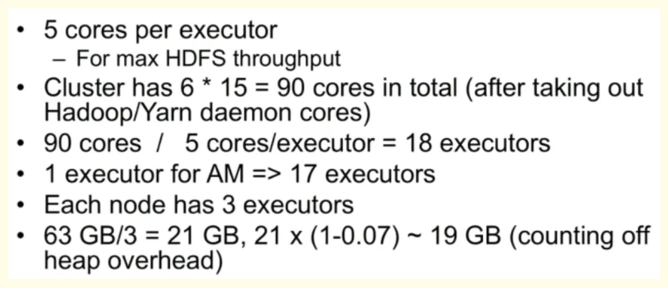

Total blocks - 128MB default block size (HDFS) - 1TB -> 1 *1024 1024/128 = 8192.

Let us take:

 1. 20 Executor-machine
 2. 5 Core processor in each executor node
 3. 6 GB RAM in each executor node

And the cluster can perform (20*5=100) Task parallel at a time, Here tasks mean block so 100 blocks can be processed parallelly at a time.

100*128MB = 12800 MB / 1024GB = 12.5 GB (So, 12GB data will get processed in 1st set of a batch)

Since the RAM size is 6GB in each executor, (20 executor x 6GB RAM =120GB Total RAM) So, at a time 12GB of RAM will occupy in a cluster (12gb/20node=0.6GB RAM In each executor).

Now, Available RAM in each executor will be (6GB - 0.6GB = 5.4GB) RAM which will be reserved for other users' jobs and programs.

So, 1TB = 1024 GB / 12GB = (Whole data will get processed in around 85 batches).

Note :- Actual values may differ in comparison with real-time scenarios.

### Case 1 Hardware — 6 Nodes and each node have 16 cores, 64 GB RAM

We start with how to choose the number of cores:

Number of cores = Concurrent tasks an executor can run

So we might think, more concurrent tasks for each executor will give better performance. But research shows that any application with more than 5 concurrent tasks, would lead to a bad show. So the optimal value is 5.

This number comes from the ability of an executor to run parallel tasks and not from how many cores a system has. So the number 5 stays the same even if we have double (32) cores in the CPU
 

Number of executors:
Coming to the next step, with 5 as cores per executor, and 15 as total available cores in one node (CPU) — we come to 3 executors per node which is 15/5. We need to calculate the number of executors on each node and then get the total number for the job.

So with 6 nodes and 3 executors per node — we get a total of 18 executors. Out of 18, we need 1 executor (java process) for Application 
Master in YARN. So the final number is 17 executors. This 17 is the number we give to spark using –num-executors while running from the spark-submit shell command.

Memory for each executor:

From the above step, we have 3 executors per node. And available RAM on each node is 63 GB

So memory for each executor in each node is 63/3 = 21GB.

However small overhead memory is also needed to determine the full memory request to YARN for each executor.

The formula for that overhead is max(384, .07 * spark.executor.memory) , Calculating that overhead: .07 * 21 (Here 21 is calculated as above  63/3) = 1.47

Since 1.47 GB > 384 MB, the overhead is 1.47

Take the above from each 21 above => 21–1.47 ~ 19 GB , So executor memory — 19 GB

**Final numbers — Executors — 17, Cores 5, Executor Memory — 19 GB**

### Case 2 Hardware — 6 Nodes and Each node have 32 Cores, 64 GB

Number of cores of 5 is the same for good concurrency as explained above.

Number of executors for each node = 32/5 ~ 6

So total executors = 6 * 6 Nodes = 36. Then the final number is 36–1(for AM) = 35

Executor memory:
6 executors for each node. 63/6 ~ 10. Overhead is .07 * 10 = 700 MB. So rounding to 1GB as overhead, we get 10–1 = 9 GB

**Final numbers — Executors — 35, Cores 5, Executor Memory — 9 GB**

### Case 3 — When more memory is not required for the executors

The above scenarios start with accepting the number of cores as fixed and moving to the number of executors and memory.

Now for the first case, if we think we do not need 19 GB, and just 10 GB is sufficient based on the data size and computations involved, then following are the numbers:

Cores: 5

Number of executors for each node = 3. Still, 15/5 as calculated above.

At this stage, this would lead to 21 GB, and then 19 as per our first calculation. But since we thought 10 is ok (assume little overhead), then we cannot switch the number of executors per node to 6 (like 63/10). Because with 6 executors per node and 5 cores it comes down to 30 cores per node when we only have 16 cores. So we also need to change the number of cores for each executor.

So calculating again, The magic number 5 comes to 3 (any number less than or equal to 5). So with 3 cores, and 15 available cores — we get 5 executors per node, 29 executors ( which is (5*6 -1)) and memory is 63/5 ~ 12.

The overhead is 12*.07=.84. So executor memory is 12–1 GB = 11 GB

**Final Numbers are 29 executors, 3 cores, executor memory is 11 GB**

