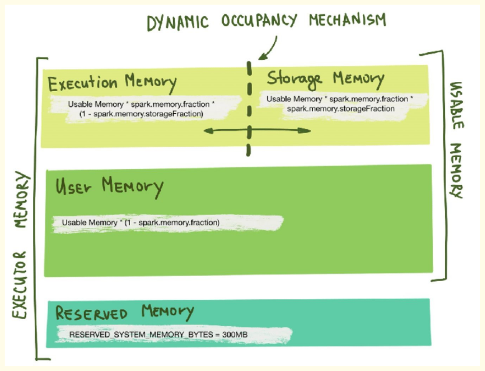
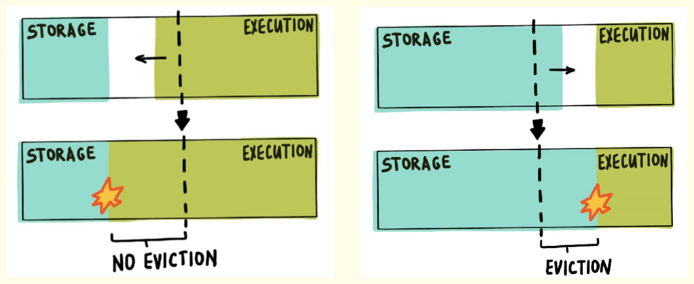

When the Spark application is launched, the Spark cluster will start two processes — Driver and Executor.

The driver is a master process responsible for creating the Spark context, submission of Spark jobs, and translation of the whole Spark pipeline into computational units — tasks. It also coordinates task scheduling and orchestration on each Executor.

Driver memory management is not much different from the typical JVM process and therefore will not be discussed further.

The executor is responsible for performing specific computational tasks on the worker nodes and returning the results to the driver, as well as providing storage for RDDs. And its internal memory management is very interesting.

Memory Management - Executor Container

When submitting a Spark job in a cluster with Yarn, Yarn allocates Executor containers to perform the job on different nodes.
ResourceManager handles memory requests and allocates executor container up to maximum allocation size settled by yarn.scheduler.maximum-allocation-mb configuration. Memory requests higher than the specified value will not take effect.

On a single node, it is done by NodeManager. NodeManager has an upper limit of resources available to it because it is limited by the resources of one node of the cluster. In Yarn it set up by yarn.nodemanager.resource.memory-mb configuration. It is the amount of physical memory per NodeManager, in MB, which can be allocated for yarn containers.
One ExecutorContainer is just one JVM. And the entire ExecutorContainer memory area is divided into three sections:

1. Heap Memory: This is the JVM heap memory where Spark runs its operations and stores data. It's further divided into:

    Execution Memory: Used for computation in shuffles, joins, sorts, and aggregations.
    
    Storage Memory: Used for caching and propagating internal data across the cluster.

    The size of the executor heap memory is controlled by the spark.executor.memory configuration property.

2. Off-Heap Memory: This is the memory managed directly by the application, not by the JVM. This memory is not subject to Java's Garbage 
Collector. Spark's core transformations and actions do not use off-heap memory by default. This can be configured using spark.executor.memoryOffHeap.enabled and spark.executor.memoryOffHeap.size

3. Overhead Memory (Non-Heap Memory): This is memory used by Spark for things outside of the executor heap memory. It includes JVM overheads, interned strings, other native overheads, etc. In containerized environments (like YARN or Kubernetes), it also accounts for non-JVM memory consumption (like Python processes).
The size of overhead memory is by default 10% of the executor memory with a minimum of 384 MB. This can be configured manually using spark.executor.memoryOverhead (absolute size) or spark.executor.memoryOverheadFactor (fraction of executor memory).

Reserved Memory: 
   The most boring part of the memory. Spark reserves this memory to store internal objects. It guarantees to reserve sufficient memory for the system even for small JVM heaps.
   Reserved Memory is hardcoded and equal to 300 MB (value RESERVED_SYSTEM_MEMORY_BYTES in source code). In the test environment (when spark.testing set) we can modify it with spark.testing.reservedMemory.
   usableMemory = spark.executor.memory - RESERVED_SYSTEM_MEMORY_BYTES

Storage Memory:  
   Storage Memory is used for caching and broadcasting data. Storage Memory size can be found by:
   Storage Memory = usableMemory * spark.memory.fraction * spark.memory.storageFraction
   Storage Memory is 30% of all system memory by default (1 * 0.6 * 0.5 = 0.3).

Execution Memory:  
   It is mainly used to store temporary data in the shuffle, join, sort, aggregation, etc. Most likely, if your pipeline runs too long, the problem lies in the lack of space here.
   Execution Memory = usableMemory * spark.memory.fraction * (1 - spark.memory.storageFraction)
   As Storage Memory, Execution Memory is also equal to 30% of all system memory by default (1 * 0.6 * (1 - 0.5) = 0.3).

User Memory:
   It is mainly used to store data needed for RDD conversion operations, such as lineage. You can store your own data structures there that will be used inside transformations. It's up to you what would be stored in this memory and how. Spark makes completely no accounting on what you do there and whether you respect this boundary or not.
   User Memory = usableMemory * (1 - spark.memory.fraction)
   It is 1 * (1 - 0.6) = 0.4 or 40% of available memory by default.

Execution and Storage have a shared memory. They can borrow it from each other. This process is called the Dynamic occupancy mechanism.
There are two parts of the shared memory — the Storage side and the Execution side. The shared Storage memory can be used up to a certain threshold. In the code, this threshold is called onHeapStorageRegionSize. This part of memory is used by Storage memory, but only if it is not occupied by Execution memory. Storage memory has to wait for the used memory to be released by the executor processes. The default size of onHeapStorageRegionSize is all Storage Memory.

When Execution memory is not used, Storage can borrow as much Execution memory as available until execution reclaims its space. When this happens, cached blocks will be evicted from memory until sufficient borrowed memory is released to satisfy the Execution memory request.
The creators of this mechanism decided that Execution memory has priority over Storage memory. They had reasons to do so — the execution of the task is more important than the cached data, the whole job can crash if there is an OOM in the execution.
