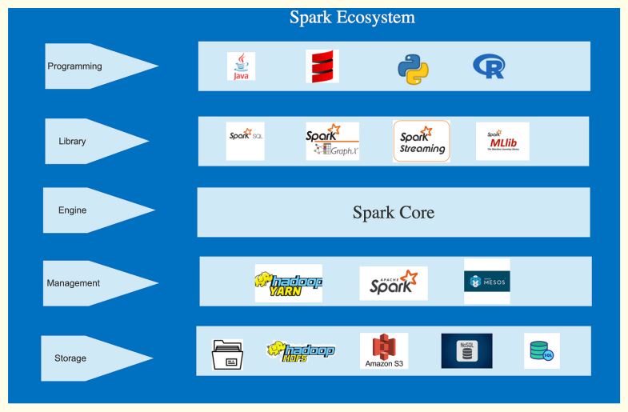
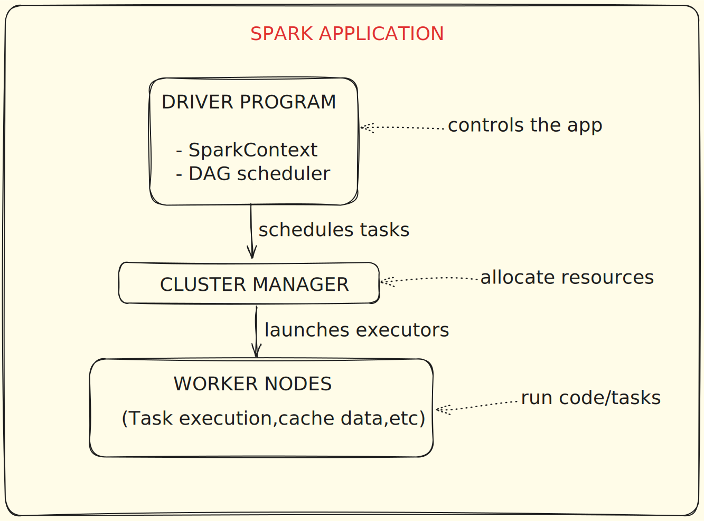
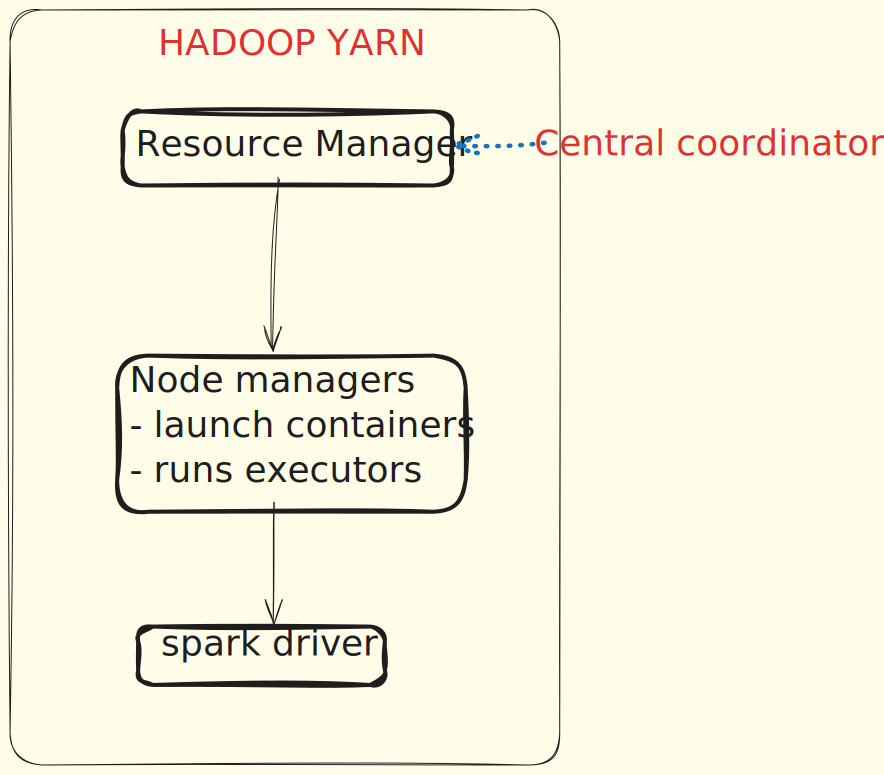

### **Problems with MapReduce**

- **Batch Processing**: Hadoop and MapReduce are designed for batch processing, making them unfit for real-time or near real-time processing such as streaming data.
- **Complexity**: Hadoop has a steep learning curve and its setup, configuration, and maintenance can be complex and time-consuming.
- **Data Movement**: Hadoop's architecture can lead to inefficiencies and network congestion when dealing with smaller data sets.
- **Fault Tolerance**: While Hadoop has data replication for fault tolerance, it can lead to inefficient storage use and doesn't cover application-level failures.
- **No Support for Interactive Processing**: MapReduce doesn't support interactive processing, making it unsuitable for tasks needing back-and-forth communication.
- **Not Optimal for Small Files**: Hadoop is less effective with many small files, as it's designed to handle large data files.

| Parameter        | Hadoop                                                                 | Spark                                                                                                                       |
|------------------|------------------------------------------------------------------------|-----------------------------------------------------------------------------------------------------------------------------|
| **Performance**   | Hadoop is slower than Spark because it writes data back to disk and reads again from disk to memory. | Spark is faster because it performs all computation in memory.                                                              |
| **Batch/Streaming** | Built for batch data processing.                                         | Built for batch as well as streaming data processing.                                                                        |
| **Ease of Use**    | Difficult to write code; Hive was built to make it easier.              | Easy to write and debug code, has interactive shell to develop and test. Spark provides high-level and low-level APIs.     |
| **Security**       | Kerberos authentication and ACL authorization.                          | Doesn’t have built-in security features.                                                                                     |
| **Fault Tolerance**| Uses block storage and replication factor to handle failure.            | Uses DAG (Directed Acyclic Graph) to provide fault tolerance.                                                                |

**-------------------------------------------------------------------------------------------------------------**

### **Apache spark**

Apache spark is unified computing engine and set of libraries for parallel data processing on computed cluster.

Apache Spark is an open-source, distributed computing system designed for big data processing and analytics. It provides an interface for programming entire clusters with implicit data parallelism and fault tolerance. 

Spark is known for its speed, ease of use, and versatility in handling multiple types of data workloads, including batch processing, real-time data streaming, machine learning, and interactive queries.

**-------------------------------------------------------------------------------------------------------------**

### **Features of Spark**

- **Speed**: Compared to Hadoop MapReduce, Spark can execute large-scale data processing up to 100 times faster. This speed is achieved by leveraging controlled partitioning.
- **Powerful Caching**: Spark's user-friendly programming layer delivers impressive caching and disk persistence capabilities.
- **Deployment**: Spark offers versatile deployment options, including through Mesos, Hadoop via YARN, or its own cluster manager.
- **Real-Time Processing**: Thanks to in-memory computation, Spark facilitates real-time computation and offers low latency.
- **Polyglot**: Spark provides high-level APIs in several languages - Java, Scala, Python, and R, allowing code to be written in any of these. It also offers a shell in Scala and Python.
- **Scalability**: Spark's design is inherently scalable, capable of handling and processing large amounts of data by distributing tasks across multiple nodes in a cluster.

**-------------------------------------------------------------------------------------------------------------**
### **Spark Ecosystem**

- **Spark Core Engine**: The foundation of the entire Spark ecosystem, the Spark Core, handles essential functions such as task scheduling, monitoring, and basic I/O operations. It also provides the core programming abstraction, Resilient Distributed Datasets (RDDs).
- **Cluster Management**: Spark's versatility allows for cluster management by multiple tools, including Hadoop YARN, Apache Mesos, or Spark's built-in standalone cluster manager. This flexibility accommodates varying requirements and operational contexts.
- **Library**: The Spark ecosystem includes a rich set of libraries

    - Spark SQL allows SQL-like queries on RDDs or data from external sources, integrating relational processing with Spark's functional programming API.

    - Spark MLlib is a library for machine learning that provides various algorithms and utilities.

    - Spark GraphX allows for the construction and computation on graphs, facilitating advanced data visualization and graph computation.

    - Spark Streaming makes it easy to build scalable, high-throughput, fault-tolerant streaming applications that can handle live data streams alongside batch processing.

- **Polyglot Programming**: Spark supports programming in multiple languages including Python, Java, Scala, and R. This broad language support makes Spark accessible to a wide range of developers and data scientists.
- **Storage Flexibility**: Spark can interface with a variety of storage systems, including HDFS, Amazon S3, local filesystems, and more. It also supports interfacing with both SQL and NoSQL databases, providing broad flexibility for various data storage and processing needs.

**-------------------------------------------------------------------------------------------------------------**
### **Spark Architecture**

 

- **Driver Program**: The driver program is the heart of a Spark application. It runs the main() function of an application and is the place where the SparkContext is created. SparkContext is responsible for coordinating and monitoring the execution of tasks. The driver program defines datasets and applies operations (transformations & actions) on them.

- **SparkContext**: The SparkContext is the main entry point for Spark functionality. It represents the connection to a Spark cluster and can be used to create RDDs, accumulators, and broadcast variables on that cluster.

- **Cluster Manager**: SparkContext connects to the cluster manager, which is responsible for the allocation of resources (CPU, memory, etc.) in the cluster. The cluster manager can be Spark's standalone manager, Hadoop YARN, Mesos, or Kubernetes.

- **Executors**: Executors are worker nodes' processes in charge of running individual tasks in a given Spark job. They run concurrently across different nodes. Executors have two roles. Firstly, they run tasks that the driver sends. Secondly, they provide in-memory storage for RDDs.

- **Tasks**: Tasks are the smallest unit of work in Spark. They are transformations applied to partitions. Each task works on a separate partition and is executed in a separate thread in executors.

- **RDD**: Resilient Distributed Datasets (RDD) are the fundamental data structures of Spark. They are an immutable distributed collection of objects, which can be processed in parallel. RDDs can be stored in memory between queries without the necessity for serialization.

- **DAG (Directed Acyclic Graph)**: Spark represents a series of transformations on data as a DAG, which helps it optimize the execution plan. DAG enables pipelining of operations and provides a clear plan for task scheduling.
Spark Architecture & Its components

- **DAG Scheduler**: The Directed Acyclic Graph (DAG) Scheduler is responsible for dividing operator graphs into stages and sending tasks to the Task Scheduler. It translates the data transformations from the logical plan (which represents a sequence of transformations) into a physical execution plan. It optimizes the plan by rearranging and combining operations where possible, groups them into stages, and then submits the stages to the Task Scheduler.

- **Task Scheduler**: The Task Scheduler launches tasks via cluster manager. Tasks are the smallest unit of work in Spark, sent by the DAG Scheduler to the Task Scheduler. The Task Scheduler then launches the tasks on executor JVMs. Tasks for each stage are launched in as many parallel operations as there are partitions for the dataset.

- **Master**: The Master is the base of a Spark Standalone cluster (specific to Spark's standalone mode, not applicable if Spark is running on YARN or Mesos). It's the central point and entry point of the Spark cluster. It is responsible for managing and distributing tasks to the workers. The Master communicates with each of the workers periodically to check if it is still alive and if it has completed tasks.

- **Worker**: The Worker is a node in the Spark Standalone cluster (specific to Spark's standalone mode). It receives tasks from the Master and executes them. Each worker has multiple executor JVMs running on it. It communicates with the Master and Executors to facilitate task execution.The worker is responsible for managing resources and providing an execution environment for the executor JVMs.

- **What happens behind the scenes**

    1. You launch the application.
    2. Spark creates a SparkContext in the Driver.
    3. Spark connects to the Cluster Manager (e.g., YARN, standalone, k8s).
    4. Cluster Manager allocates Workers and starts Executors.
    5. RDD transformations are converted into a DAG (Directed Acyclic Graph.
    6. Spark creates Stages, breaks them into Tasks (based on partitions).
    7. Tasks are shipped to Executors.
    8. Executors run the tasks and return results back to the Driver.
    9. Final results (e.g., word count) are written to HDFS.

**-------------------------------------------------------------------------------------------------------------**

### **Spark Standalone**

Spark Standalone mode is a built-in cluster manager in Apache Spark that enables you to set up a dedicated Spark cluster without needing external resource managers like Hadoop YARN or Kubernetes.

It is easy to deploy, suitable for development and testing, and supports distributed data processing across multiple nodes.

!!! Advantages

    - Easy to set up and manage
    - No need for external resource managers
    - Built-in web UI for monitoring
    - Supports HA (High Availability) with ZooKeeper

!!! Limitations

    - Less fault-tolerant than YARN or Kubernetes
    - Limited support for resource isolation and fairness
    - Not recommended for large-scale production

**-------------------------------------------------------------------------------------------------------------**

### **Spark with YARN**

Apache Spark on YARN means running Spark applications on top of Hadoop YARN (Yet Another Resource Negotiator) - the resource manager in Hadoop ecosystems. This setup allows Spark to share cluster resources with other big data tools (like Hive, HBase, MapReduce) in a multi-tenant environment.

YARN handles resource management, job scheduling, and container allocation, while Spark focuses on data processing.

- **Resource Manager**: It controls the allocation of system resources on all applications. A Scheduler and an Application Master are included. Applications receive resources from the Scheduler.

- **Node Manager**: Each job or application needs one or more containers, and the Node Manager monitors these containers and their usage. Node Manager consists of an Application Master and Container. The Node Manager monitors the containers and resource usage, and this is reported to the Resource Manager.

- **Application Master**: The ApplicationMaster (AM) is an instance of a framework-specific library and serves as the orchestrating process for an individual application in a distributed environment.

!!! Advantages

    - Leverages existing Hadoop cluster (no separate setup)
    - Resource sharing across Hadoop ecosystem
    - Supports HDFS, Hive, HBase integration natively
    - Production-grade scalability and stability

!!! Considerations

    - Slight overhead from YARN’s container management
    - Configuration tuning (memory, executor placement) is important
    - YARN needs to be properly secured (Kerberos, ACLs)

