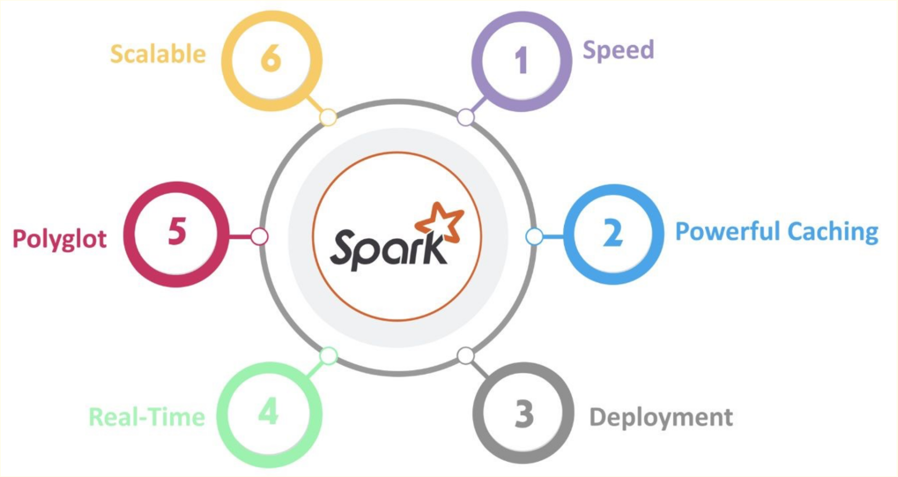

### Problems with Hadoop Map-Reduce

1. Batch Processing: Hadoop and MapReduce are designed for batch processing, making them unfit for real-time or near real-time processing such as streaming data.
2. Complexity: Hadoop has a steep learning curve and its setup, configuration, and maintenance can be complex and time-consuming.
3. Data Movement: Hadoop's architecture can lead to inefficiencies and network congestion when dealing with smaller data sets.
4. Fault Tolerance: While Hadoop has data replication for fault tolerance, it can lead to inefficient storage use and doesn't cover application-level failures.
5. No Support for Interactive Processing: MapReduce doesn't support interactive processing, making it unsuitable for tasks needing back-and-forth communication.
6. Not Optimal for Small Files: Hadoop is less effective with many small files, as it's designed to handle large data files.

### Apache spark

Apache Spark is an open-source, distributed computing system designed for big data processing and analytics. It provides an interface for programming entire clusters with implicit data parallelism and fault tolerance. Spark is known for its speed, ease of use, and versatility in handling multiple types of data workloads, including batch processing, real-time data streaming, machine learning, and interactive queries.

### Features Of Spark

1. Speed: Compared to Hadoop MapReduce, Spark can execute large-scale data processing up to 100 times faster. This speed is achieved by leveraging controlled partitioning.
2. Powerful Caching: Spark's user-friendly programming layer delivers impressive caching and disk persistence capabilities.
3. Deployment: Spark offers versatile deployment options, including through Mesos, Hadoop via YARN, or its own cluster manager.
4. Real-Time Processing: Thanks to in-memory computation, Spark facilitates real-time computation and offers low latency.
5. Polyglot: Spark provides high-level APIs in several languages - Java, Scala, Python, and R, allowing code to be written in any of these. It also offers a shell in Scala and Python.
6. Scalability: Spark's design is inherently scalable, capable of handling and processing large amounts of data by distributing tasks across multiple nodes in a cluster.

### Spark Ecosystem

1. Spark Core Engine: The foundation of the entire Spark ecosystem, the Spark Core, handles essential functions such as task scheduling, monitoring, and basic I/O operations. It also provides the core programming abstraction, Resilient Distributed Datasets (RDDs).
2. Cluster Management: Spark's versatility allows for cluster management by multiple tools, including Hadoop YARN, Apache Mesos, or Spark's built-in standalone cluster manager. This flexibility accommodates varying requirements and operational contexts.
3. Library: The Spark ecosystem includes a rich set of libraries:
a. Spark SQL allows SQL-like queries on RDDs or data from external sources, integrating relational processing with Spark's functional programming API.
b. Spark MLlib is a library for machine learning that provides various algorithms and utilities.
c. Spark GraphX allows for the construction and computation on graphs, facilitating advanced data visualization and graph computation.
d. Spark Streaming makes it easy to build scalable, high-throughput, fault-tolerant streaming applications that can handle live data streams alongside batch processing.
4. Polyglot Programming: Spark supports programming in multiple languages including Python, Java, Scala, and R. This broad language support makes Spark accessible to a wide range of developers and data scientists.
5. Storage Flexibility: Spark can interface with a variety of storage systems, including HDFS, Amazon S3, local filesystems, and more. It also supports interfacing with both SQL and NoSQL databases, providing broad flexibility for various data storage and processing needs.
