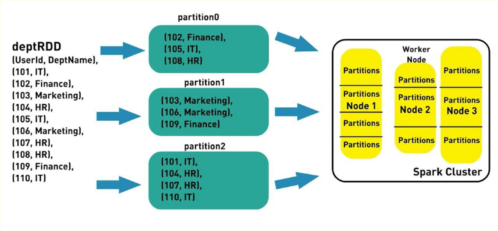

1. Data Partitioning: Apache Spark partitions data into logical chunks during reading from sources like HDFS, S3, etc.
2. Data Distribution: These partitions are distributed across the Spark cluster nodes, allowing for parallel processing.
3. Custom Partitioning: Users can control data partitioning using Spark's repartition(), coalesce() and partitionBy() methods, optimizing data locality or skewness.

When Apache Spark reads data from a file on HDFS or S3, the number of partitions is determined by the size of the data and the default block size of the file system. In general, each partition corresponds to a block in HDFS or an object in S3.
For example, if HDFS is configured with a block size of 128MB and you have a 1GB file, it would be divided into 8 blocks in HDFS. Therefore, when Spark reads this file, it would create 8 partitions, each corresponding to a block.
