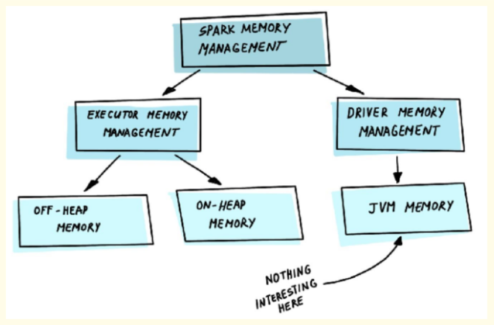
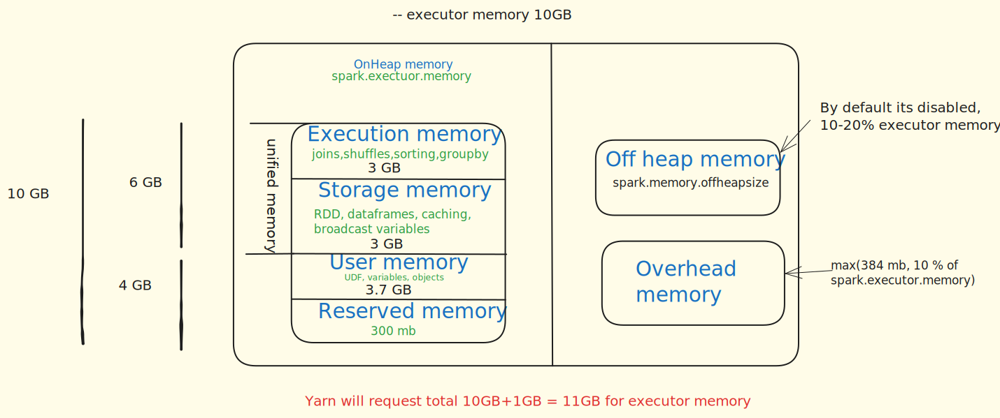

When the Spark application is launched, the Spark cluster will start two processes — Driver and Executor.

The driver is a master process responsible for creating the Spark context, submission of Spark jobs, and translation of the whole Spark pipeline into computational units — tasks. It also coordinates task scheduling and orchestration on each Executor.

Driver memory management is not much different from the typical JVM process.

The executor is responsible for performing specific computational tasks on the worker nodes and returning the results to the driver, as well as providing storage for RDDs. And its internal memory management is very interesting.

**-------------------------------------------------------------------------------------------------------------**

### **Executor memory**

A Spark executor container has three major components of memory:

#### **On-Heap Memory**

This occupies the largest block and is where most of Spark's operations run .The On-Heap memory is managed by the JVM (Java Virtual Machine). Even though Spark is written in Scala and you might write code in Python using PySpark (which uses a wrapper around Java APIs), the underlying execution still happens on the JVM.

The On-Heap memory is further divided into four sections:

- **Execution Memory**: 
    It is mainly used to store temporary data in the shuffle, join, sort, aggregation, etc. Most likely, if your pipeline runs too long, the problem lies in the lack of space here.

    !!! Note

        Execution Memory = usableMemory * spark.memory.fraction * (1 - spark.memory.storageFraction).
    
        As Storage Memory, Execution Memory is also equal to 30% of all system memory by default (1 * 0.6 * (1 - 0.5) = 0.3).

- **Storage Memory**: 
    This is where caching (for RDDs or DataFrames) occurs, and it's also used for storing broadcast variables.
    Storage Memory is used for caching and broadcasting data. 
    
    !!! Note
    
        Storage Memory = usableMemory * spark.memory.fraction * spark.memory.storageFraction
    
        Storage Memory is 30% of all system memory by default (1 * 0.6 * 0.5 = 0.3).

- **User Memory**:
    Used for storing user objects such as variables, collections (lists, sets, dictionaries) defined in your program, or User Defined Functions (UDFs).
    It is mainly used to store data needed for RDD conversion operations, such as lineage. You can store your own data structures there that will be used inside transformations. It's up to you what would be stored in this memory and how. Spark makes completely no accounting on what you do there and whether you respect this boundary or not.

    !!! Note

        User Memory = usableMemory * (1 - spark.memory.fraction)

        It is 1 * (1 - 0.6) = 0.4 or 40% of available memory by default.

- **Reserved Memory**: 
    This is the memory Spark needs for running itself and storing internal objects
    The most boring part of the memory. Spark reserves this memory to store internal objects. It guarantees to reserve sufficient memory for the system even for small JVM heaps.
    
    !!! Note
        
        Reserved Memory is hardcoded and equal to 300 MB (value RESERVED_SYSTEM_MEMORY_BYTES in source code). In the test environment (when spark.testing set) we can modify it with spark.testing.reservedMemory.
        
        usableMemory = spark.executor.memory - RESERVED_SYSTEM_MEMORY_BYTES

- **Unified memory**:
    
    Unified memory refers to the Execution memory and Storage memory combined.
    
    - **Why it's "Unified"**: It's due to Spark's dynamic memory management strategy.This means if execution memory needs more space, it can use some of the storage memory, and vice-versa. There is a priority given to execution memory because critical operations like joins, shuffles, sorting, and group by happen there. The division between execution and storage is represented as a movable "slider".

    Evolution of Unified Memory (Pre-Spark 1.6 vs. Post-Spark 1.6):
    
    - **Before Spark 1.6**: The space allocated to execution and storage memory was fixed.
        If execution needed more memory but its fixed allocation was full, it could not use available space in storage memory, leading to wasted memory.
    - **After Spark 1.6 (>= Spark 1.6)**: The "slider" became movable, allowing dynamic allocation based on needs.

- **Rules for Slider Movement (Dynamic Allocation)**:

    Execution needs more memory, and Storage has vacant space: If storage is not using all its allocated space, execution can simply use that vacant portion of memory.

    Execution needs more memory, and Storage is occupied: If storage is using its blocks, it will evict some of its blocks (least recently used or LRU algorithm) to make room for execution memory.

    Storage needs more memory: In this case, because execution has priority, none of the execution blocks will be evicted. Storage must evict its own blocks (based on LRU) to free up space for new cached data

#### **Off-Heap Memory**

Off-Heap memory is often the least talked about and least used, but it can be very useful in certain situations.
- Default State: It is disabled by default (spark.memory.offHeap.enabled is set to zero).

- Enabling and Sizing: You can enable it by setting spark.memory.offHeap.enabled to true and specify its size using spark.memory.offHeap.size. A good starting point for its size is 10% to 20% of your executor memory.
- Structure: Similar to unified memory, off-heap memory also has two parts: execution and storage.
- Purpose/Use Case: It becomes useful when the on-heap memory is full.
    - When on-heap memory is full, a garbage collection (GC) cycle occurs, which pauses the program's operation to clean up unwanted objects. These GC pauses can negatively impact program performance.
    - Off-Heap memory is managed by the Operating System, not the JVM. Therefore, it is not subject to the JVM's GC cycles.
- Developer Responsibility: Since it's not subject to GC, the Spark developer is responsible for both the allocation and deallocation of memory in the off-heap space. This adds complexity and requires caution to avoid memory leaks.
- Performance: Off-heap memory is slower than on-heap memory. However, if Spark had to choose between spilling data to disk or using off-heap memory, using off-heap memory would be a better choice because writing to disk is several orders of magnitude slower

#### **Overhead Memory**

Used for internal system-level operations

!!! Example
            
    Calculation: The overhead memory is defined as the maximum of 384 MB or 10% of the spark.executor.memory.
    If spark.executor.memory is 10 GB, 10% of it is 1 GB.
    max(384 MB, 1 GB) = **1 GB**. So, the overhead memory would be 1 GB.

It's important to note that the spark.executor.memory parameter only allocates for on-heap memory. When Spark requests memory from a cluster manager (like YARN), it adds the executor memory and the overhead memory. If off-heap memory is enabled, it will also add that amount to the request.

!!! Example 
    
    If spark.executor.memory is 10 GB, and overhead is 1 GB (and off-heap is disabled), Spark will request 10 GB + 1 GB = **11 GB** from the cluster manager for that container

#### **Why Out of Memory Occurs Even When Spillage is Possible**
Despite the ability to spill data to disk from the Execution Memory Pool, an Out of Memory Exception can still occur, especially during operations like joins or aggregations:

- **The Problem of Data Skew**: If data for a single key (e.g., ID=1) becomes excessively large (e.g., 3GB), exceeding the available Execution Memory Pool (e.g., 2.9GB), it cannot be processed.

- **Impossibility of Partial Spillage**: During operations like joins, all data related to a specific key must be present on the same executor for the operation to complete correctly. If a 3GB chunk of data for a single ID has to be processed, and only 2.9GB is available, it's impossible to spill just a portion of that key's data. Spilling half of the 3GB data would mean the join would not yield the correct result for that key. Therefore, if a single partition or a single key's data exceeds the physical memory capacity of the executor's Execution Memory Pool (even with potential spill), an Out of Memory Exception is inevitable.

#### **Solutions to Out of Memory Exception**

- **Repartitioning**: Redistributing data across more partitions.
- **Salting**: A technique to add a "salt" to skewed keys to distribute them more evenly during shuffles.
- **Sorting**: Pre-sorting data can sometimes help with certain types of joins (e.g., Sort-Merge Join) to reduce memory pressure.

**-------------------------------------------------------------------------------------------------------------**

### **Driver Memory** 

The Spark driver has its own dedicated memory. You can configure the driver's memory when starting a PySpark session.

Requesting Driver Memory: To request a specific amount of driver memory, you can use the pyspark command with the --driver-memory flag: pyspark --driver-memory 1g

This command requests 1 GB of driver memory from your local setup. After starting the session, you can verify the Spark driver memory configuration by navigating to localhost:4040/jobs in your web browser.

**Types of Driver Memory**
Within the Spark driver, there are two main types of memory that work together

- **JVM Heap Memory (spark.driver.memory)**:This is the primary memory allocated for the driver's Java Virtual Machine (JVM) processes. All JVM-related operations, such as scheduling tasks and handling responses from executors, primarily use this memory.This is what you configure using --driver-memory or spark.driver.memory.

- **Memory Overload (spark.driver.memoryOverhead)**: This memory is dedicated to non-JVM processes.
    It handles objects created by your application that are not part of the JVM heap.
    It also accounts for the memory requirements of the application master container itself, which hosts the driver.

    !!! Note
    
        By default, spark.driver.memoryOverhead is calculated as 10% of spark.driver.memory.
        However, there's a minimum threshold: if 10% of spark.driver.memory is less than 384 MB, then spark.driver.memoryOverhead will default to 384 MB. The system picks whichever value is higher.
        
        - Example 1 (1GB driver memory): 10% of 1GB is 100 MB. Since 100 MB is less than 384 MB, the memoryOverhead will be 384 MB.
        - Example 2 (4GB driver memory): 10% of 4GB is 400 MB. Since 400 MB is greater than 384 MB, the memoryOverhead will be 400 MB.
        - Example 3 (20GB driver memory): 10% of 20GB is 2GB. In this case, the memoryOverhead would be 2GB memory**

#### **Common Reasons for Driver Out of Memory**

Besides the collect() method, several other common scenarios can lead to driver OOM:

- Using collect() Method on Large Datasets: As demonstrated, attempting to pull all data to the driver's memory will cause an OOM if the data size exceeds the driver's capacity.

- **Broadcasting Large DataFrames/Tables**:
    Broadcasting is a technique used in Spark to optimize joins by sending a smaller DataFrame or table to all executors so that the larger DataFrame can be joined locally without shuffling data.
     When you broadcast data (e.g., df2 and df3 in the example), the driver first merges and holds this data in its memory.
     Then, the driver sends this combined data to all executors.
     If you broadcast multiple large DataFrames (e.g., five 50 MB DataFrames, totaling 250 MB) and the driver doesn't have enough memory to hold them before distributing them, it will lead to a driver OOM error. This is why broadcasting is recommended only for small tables/DataFrames.
- **Excessive Object Creation and Heavy Non-JVM Processing**:
     If your Spark application creates many objects or performs heavy processing that falls under non-JVM operations, it consumes the memoryOverhead.
     If the memoryOverhead is insufficient, it can lead to OOM errors often indicated as being "due to memory overhead".
- **Incorrect Memory Configuration**:
    Manually setting spark.driver.memory or spark.driver.memoryOverhead to values that are too low for the workload can lead to OOM.
    
    !!! Example
        
        If you have a 20 GB driver but incorrectly set spark.driver.memoryOverhead to 1 GB when it should ideally be 2 GB (10% of 20GB), you might encounter an OOM error related to memoryOverhead

#### **Handling and Solving Driver Out of Memory**
Based on the reasons for OOM, the solutions are often direct:

- **Avoid collect() on Large Data**:
    For large datasets, never use df.collect() unless you are absolutely certain the data size is small enough to fit within the driver's memory.
    Instead, use df.show() for quick inspection.
    If you need to process all data, consider writing it to a file system (like HDFS or S3) or processing it in a distributed manner across executors.
- **Manage Broadcasted Data Carefully**:
    Only broadcast DataFrames or tables that are genuinely small.
    Before broadcasting, ensure the driver's memory (specifically the JVM heap) is large enough to hold the combined size of all dataframes you plan to broadcast.
- **Increase Driver Memory and Memory Overhead**:
    If your application performs extensive non-JVM operations or creates many objects, you might need to increase spark.driver.memory and/or spark.driver.memoryOverhead.
    If you observe "due to memory overhead" errors, explicitly increasing spark.driver.memoryOverhead beyond its default 10% (while respecting system limits) might resolve the issue
