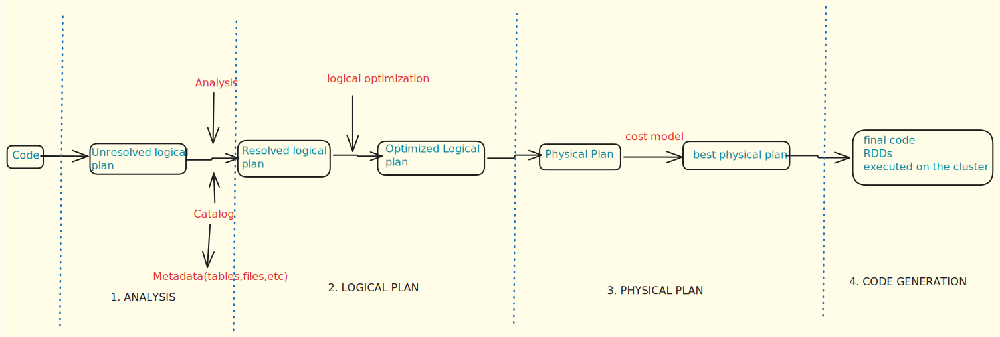

The Spark SQL Engine is fundamentally the Catalyst Optimizer. Its primary role is to convert user code (written in DataFrames, SQL, or Datasets) into Java bytecode for execution. This conversion and optimization process occurs in four distinct phases. It's considered a compiler because it transforms your code into Java bytecode. It plays a key role in optimizing code leveraging concepts like lazy evaluation




### **Phase 1: Unresolved Logical Plan**

- **User Code Input**: This is the initial stage where you write your code using DataFrames, SQL, or Datasets APIs.

- **Action**: When you write transformations (e.g., select, filter, join), Spark creates an "unresolved logical plan". This plan is like a blueprint or a "log" of transformations, indicating what operations need to be performed in what order.
 
- **Nature**: At this stage, the plan is "unresolved" because Spark has not yet checked if the tables, columns, or files referenced actually exist

### **Phase 2: Analysis**

- **Purpose**: To resolve the logical plan by checking the existence and validity of all referenced entities.

- **Role of Catalog**: This phase heavily relies on the Catalog.
The Catalog is where Spark stores metadata (data about data).
It contains information about tables, files, databases, their names, creation times, sizes, column names, and data types.
For example, if you read a CSV file, the Catalog knows its path, name, and column headers.

- **Validation**: The Analysis phase queries the Catalog to verify if the files, columns, or tables specified in the unresolved logical plan actually exist.

- **Output**:
If everything is found and validated, the plan becomes a "Resolved Logical Plan".
If any entity is not found (e.g., a non-existent file path or a misspelled column name), Spark throws an AnalysisException


### **Phase 3: Logical Optimization**

- **Purpose**: To optimize the "Resolved Logical Plan" without considering the physical execution aspects. It focuses on making the logical operations more efficient.

- **Optimization Examples**:

    !!! Note 
   
        *Predicate Pushdown*: If you apply multiple filters, the optimizer might combine them or push them down closer to the data source to reduce the amount of data processed early.
 
        *Column Pruning*: If you select all columns (SELECT *) but then only use a few specific columns in subsequent operations, the optimizer will realize this and modify the plan to only fetch the necessary columns from the start, saving network I/O and processing.

- **Leveraging Lazy Evaluation**: This phase benefits from Spark's lazy evaluation, allowing it to perform these optimizations before any actual computation begins.

- **Output**: An "Optimized Logical Plan"


### **Phase 4: Physical Planning**

- **Conversion**: The "Optimized Logical Plan" is converted into multiple possible "Physical Plans". Each physical plan represents a different strategy for executing the logical operations (e.g., different join algorithms).
 
- **Cost-Based Model**: Spark applies a "Cost-Based Model" to evaluate these physical plans. It estimates the resources (memory, CPU, network I/O) each plan would consume if executed.
 
- **Strategy Selection**: The plan that offers the best resource utilization and lowest estimated cost (e.g., least data shuffling, fastest execution time) is selected as the "Best Physical Plan".
 
    !!! example
  
        For joins, if one table is significantly smaller than the other, Spark might choose a Broadcast Join. This involves sending the smaller table to all executor nodes where the larger table's partitions reside. This avoids data shuffling (expensive network operations) of the larger table across the cluster, leading to significant performance gains.

- **Output**: The Best Physical Plan, which is essentially a set of RDDs (Resilient Distributed Datasets) ready to be executed on the cluster.

### **Phase 5:Whole-Stage Code Generation**
 
- **Final Step**: This is the final step where the "Best Physical Plan" (the RDD operations) is translated into Java bytecode.
 
- **Execution**: This bytecode is then sent to the individual executors on the cluster to be executed. This direct bytecode generation improves performance by eliminating interpretation overhead and allowing the JVM to further optimize the code.

### In what cases will predicate pushdown not work?
- **Complex Data Types**

Spark's Parquet data source does not push down filters that involve complex types, such as arrays, maps, and struct. This is because these complex data types can have complicated nested structures that the Parquet reader cannot easily filter on.

Here's an example:

```
root
 |-- Name: string (nullable = true)
 |-- properties: map (nullable = true)
 |    |-- key: string
 |    |-- value: string (valueContainsNull = true)

+----------+-----------------------------+
|Name      |properties                   |
+----------+-----------------------------+
|Afaque    |[eye -> black, hair -> black]|
|Naved     |[eye ->, hair -> brown]      |
|Ali       |[eye -> black, hair -> red]  |
|Amaan     |[eye -> grey, hair -> grey]  |
|Omaira    |[eye -> , hair -> brown]     |
+----------+-----------------------------+
```

```python
df.filter(df.properties.getItem("eye") == "brown").show()
```

```
== Physical Plan ==
*(1) Filter (metadata#123[key] = value)
+- *(1) ColumnarToRow
   +- FileScan parquet [id#122,metadata#123] Batched: true, DataFilters: [(metadata#123[key] = value)], Format: Parquet, ...
```

- **Unsupported Expressions** 

In Spark, `Parquet` data source does not support pushdown for filters involving a `.cast` operation.

The reason for this behaviour is as follows: `.cast` changes the datatype of the column, and the Parquet data source may not be able to perform the filter operation correctly on the cast data.

!!! Note
   
    This behavior may vary based on the data source. For example, if you're working with a JDBC data source connected to a database that supports SQL-like operations, the `.cast` filter could potentially be pushed down to the database.