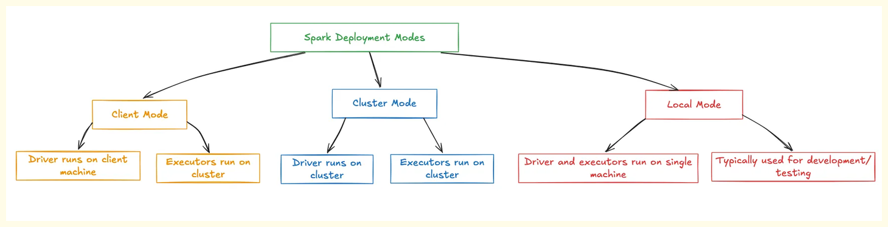
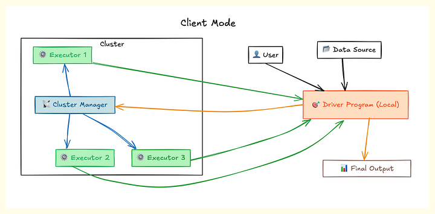
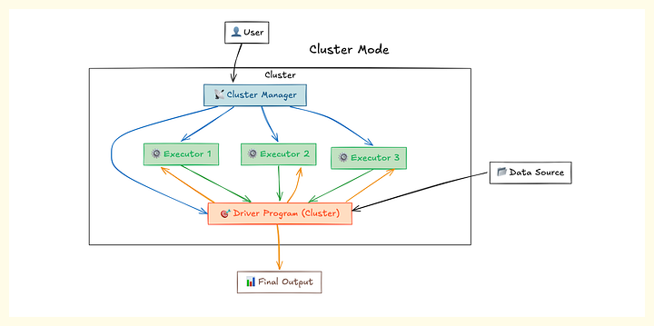
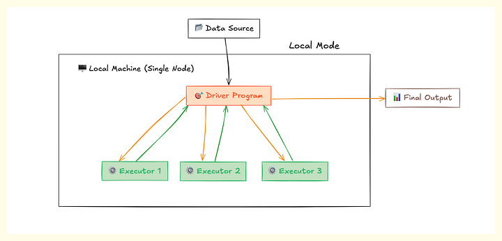

### **What is Spark Submit?**
Spark Submit is a command-line tool that allows you to trigger or run your Spark applications on a Spark cluster. It packages all the required files and JARs (Java Archive files) and deploys them to the Spark cluster for execution. It is used to run jobs on various types of Spark clusters

### **Where is Your Spark Cluster Located?**
Spark clusters can be deployed in multiple environments. When using Spark Submit, you specify the location of your master node.

Common cluster types include:

- Standalone Cluster: A simple, self-contained Spark cluster. An example master configuration for a standalone cluster could look like spark://10.160.78.10:7077, where 7077 is the default port.
- Local Mode: For running Spark applications on your local machine, typically for development or testing. The master configuration is simply local.
- YARN (Yet Another Resource Negotiator): A popular resource management system in the Hadoop ecosystem. The master configuration is yarn.
- Kubernetes: A container orchestration system.
- Mesos: Another cluster management platform

## **spark-submit command**
   
!!! Example
    
    spark-submit  
    --master {stanadlone,yarn.mesos,kubernetes}  
    --deploy-mode {client/cluster}  
    --class mainclass.scala   
    --jars mysql-connector.jar   
    --conf spark.dynamicAllocation.enabled=true    
    --conf spark.dynamicAllocation.minExecutors=1    
    --conf spark.dynamicAllocation.maxExecutors=10    
    --conf spark.sql.broadcastTimeout=3600    
    --conf spark.sql.autobroadcastJoinThreshold=100000    
    --conf spark.executor.cores=2    
    --conf spark.executor.instances=5    
    --conf spark.default.parallelism=20    
    --conf spark.driver.maxResultSize=1G    
    --conf spark.network.timeout=800   
    --conf spark.driver.maxResultSize=1G    
    --conf spark.network.timeout=800    
    --driver-memory 1G    
    --executor-memory 2G    
    --num-executors 5    
    --executor-cores 2    
    --py-files /path/to/other/python/files.zip 
    /path/to/your/python/wordcount.py    /path/to/input/textfile.txt 

- **master**: This is the master URL for the cluster. It can be a URL for any Spark-supported cluster manager. For example, local for local mode, spark://HOST:PORT for standalone mode, mesos://HOST:PORT for Mesos, or yarn for YARN.

- **deploy-mode**: This can be either client (default) or cluster. In client mode, the driver runs on the machine from which the job is submitted. In cluster mode, the framework launches the driver inside the cluster.

- **class**: This is the entry point for your application, i.e., where your main method runs. For Java and Scala, this would be a fully qualified class name.

- **jars**: This argument allows you to provide paths to external JAR files that your Spark application depends on. You can provide multiple JAR files as a comma-separated list. It's recommended to use absolute paths for JAR files to prevent future issues, even if they are in the same directory

- **conf**: This is used to set any Spark property. For example, you can set Spark properties like spark.executor.memory, spark.driver.memory, etc.
    - spark.dynamicAllocation.enabled true: Enables dynamic memory allocation.
    - spark.dynamicAllocation.minExecutors 1: Sets the minimum number of executors to 1.
    - spark.dynamicAllocation.maxExecutors 10: Sets the maximum number of executors to 10. This prevents a single process from hogging all resources. This is beneficial because if a process reserves memory but doesn't use it, dynamic allocation can free up that idle memory for other processes.
    - Broadcast Threshold: This configuration determines the maximum size of data that Spark will automatically broadcast to all worker nodes when performing a join. The default is 10MB.
    - Broadcast Timeout: This sets the maximum time (in seconds) that a broadcast operation is allowed to take before timing out. A common general setting might be 600 seconds (10 minutes) or 1200 seconds (20 minutes), while 3600 seconds (1 hour) is considered very long and can significantly delay job completion
    - spark.executor.cores=2 sets the number of cores to use on each executor.
    - spark.executor.instances=5: sets the number of executor instances
    - spark.default.parallelism=20: sets the default number of partitions in RDDs returned by transformations like join(), reduceByKey(), and parallelize() when not set by user.
    - spark.driver.maxResultSize=1G:  limits the total size of the serialized results of all partitions for each Spark action (e.g., collect). This should be at least as large as the largest object you want to collect.
    - spark.network.timeout=800:  sets the default network timeout value to 800 seconds. This configuration plays a vital role in cases where you deal with large shuffles.

- **driver-memory**: Specifies the amount of memory allocated to the Spark Driver program.

- **executor-memory**: Specifies the amount of memory allocated to each Spark Executor.

- **num-executors**: Specifies the total number of executors to launch for the application. Combined with --executor-memory, this implies the total executor memory required (e.g., 2 GB/executor * 5 executors = 10 GB total executor memory).

- **executor-cores**: Specifies the number of CPU cores allocated to each executor. This determines how many parallel tasks an executor can run

- **files**: This argument is used to specify non-Python files (e.g., configuration files like .ini, .json, .csv) that your Spark application needs. Similar to --py-files, these are bundled and distributed to all worker nodes

After all the Spark Submit configurations, you provide the path to your main application script (e.g., main.py). Any values provided after the main script are treated as command-line arguments that can be accessed within your script.

- **main.py**: This is typically accessed as sys.argv in Python.

- **Subsequent arguments**: These are sys.argv, sys.argv, and so on. They are useful for passing dynamic parameters like environment names (e.g., dev, qa, prod) to control execution flow within your script without changing the script itself

- **application-jar**: This is a path to your compiled Spark application.

- **application-arguments**: These are arguments that you need to pass to your Spark application

### **Client Mode**

In Client mode, the Spark Driver runs directly on the edge node (or the machine from which the spark-submit command is executed).

The Executors, however, still run on the worker nodes within the cluster.

- **Advantages**:
    - Easy Debugging and Real-time Logs: Logs (STD OUT and STD ERR) are generated directly on the client machine (edge node). This makes it very easy for developers to monitor the process, see real-time output, debug issues, and observe errors as they occur. This mode is highly suitable for development and testing of small code snippets.
- **Disadvantages**:
    - Vulnerability to Edge Node Shutdown: If the edge node is shut down, either accidentally or intentionally, the Spark Driver (running on it) will be terminated. Since the Driver coordinates the entire application, its termination will cause all associated Executors to be killed, leading to the entire Spark job stopping abruptly and incompletely.
    - High Network Latency: Communication between the Driver (on the edge node) and the Executors (on worker nodes in the cluster) involves two-way communication across the network. This can introduce network latency, especially for operations like Broadcaster, where data needs to be first sent to the Driver and then distributed to Executors.
    - Potential for Driver Out of Memory (OOM) Errors: If multiple users submit jobs in Client mode from the same edge node, and their collective Driver memory requirements exceed the edge node's physical memory capacity (which is typically lower than worker nodes), processes may fail to start or encounter Driver OOM errors

When u start a spark shell, application driver creates the spark session in your local machine which request to Resource Manager present in cluster to create Yarn application. YARN Resource Manager start an Application Master (AM container). For client mode Application Master acts as the Executor launcher. Application Master will reach to Resource Manager and request for further containers. 
Resource manager will allocate new containers. These executors will directly communicate with Drivers which is present in the system in which you have submitted the spark application.

### **Cluster Mode**

For cluster mode, there’s a small difference compare to client mode in place of driver. Here Application Master will create driver in it and driver will reach to Resource Manager.

In Cluster mode, the Spark Driver (Application Master container) is launched and runs on one of the worker nodes within the Spark cluster. The Executors also run on other worker nodes in the cluster.

- **Advantages**:
    - Resilience and Disconnect-ability: Once a Spark job is submitted in Cluster mode, the Driver runs independently within the cluster. This means the user can disconnect from or even shut down their edge node machine without affecting the running Spark application. This makes it ideal for long-running jobs.
    - Low Network Latency: Both the Driver and the Executors are running within the same cluster. This proximity significantly reduces network latency between them, leading to more efficient data transfer and communication.
    - Scalability and Resource Utilization: Worker nodes are provisioned with significant memory and processing capabilities. By running the Driver on a worker node, the application can leverage the cluster's robust resources, reducing the likelihood of Driver OOM issues, even with many concurrent jobs.
    - Suitable for Production Workloads: Cluster mode is the recommended deployment mode for production workloads, especially for scheduled jobs that run automatically and do not require constant real-time monitoring on the client side.
- **Disadvantages**:
    Indirect Log Access: Logs and output are not directly displayed on the client machine. When a job is submitted in Cluster mode, an Application ID is generated. Users must use this Application ID to access the Spark Web UI (User Interface) to track the job's status, progress, and logs. This adds an extra step for monitoring compared to Client mode

### **Local Mode**

In local mode, Spark runs on a single machine, using all the cores of the machine. It is the simplest mode of deployment and is mostly used for testing and debugging.

### **Comparison**

| Feature              | Client Mode                                      | Cluster Mode                                    |
| -------------------- | ------------------------------------------------ | ----------------------------------------------- |
| Driver Location      | Edge Node (or client machine)                    | Worker Node within the cluster                  |
| Log Generation       | On client machine (STD OUT, STD ERR)             | Application ID generated; view via Spark Web UI |
| Debugging            | Easy, real-time feedback                         | Requires checking Spark Web UI                  |
| Network Latency      | High (Driver <-> Executors across network)       | Low (Driver <-> Executors within cluster)       |
| Edge Node Shutdown   | Application stops (Driver killed)                | Application continues to run                    |
| Driver Out of Memory | Higher chance if many users/low edge node memory | Lower chance (cluster has more resources)       |
| Use Case             | Development, small code snippets, debugging      | Production workloads, long-running jobs         |

