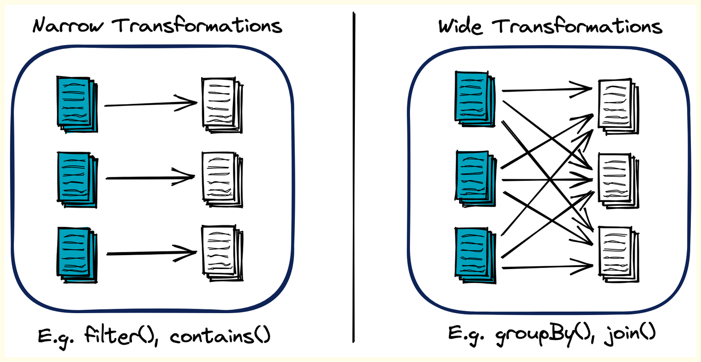

Spark represents a sequence of transformations on data as a DAG, a concept borrowed from mathematics and computer science. A DAG is a directed graph with no cycles, and it represents a finite set of transformations on data with multiple stages. The nodes of the graph represent the RDDs or DataFrames/Datasets, and the edges represent the transformations or operations applied.

Each action on an RDD (or DataFrame/Dataset) triggers the creation of a new DAG. The DAG is optimized by the Catalyst optimizer (in case of DataFrame/Dataset) and then it is sent to the DAG scheduler, which splits the graph into stages of tasks.

**-------------------------------------------------------------------------------------------------------------**

### **Job, Stage and Task in Spark**


- **Application**
An application in Spark refers to any command or program that you submit to your Spark cluster for execution.
Typically, one spark-submit command creates one Spark application. You can submit multiple applications, but each spark-submit initiates a distinct application.

- **Job**
Within an application, jobs are created based on "actions" in your Spark code.
An action is an operation that triggers the computation of a result, such as collect(), count(), write(), show(), or save().
If your application contains five actions, then five separate jobs will be created.
Every job will have a minimum of one stage and one task associated with it.

- **Stage**
A job is further divided into smaller parts called stages.
Stages represent a set of operations that can be executed together without shuffling data across the network. Think of them as logical steps in a job's execution plan. Stages are primarily defined by "wide dependency transformations".

    !!! Note

        **Wide Dependency Transformations** (e.g., repartition(), groupBy(), join()) require shuffling data across partitions, meaning data from one partition might be needed by another. Each wide dependency transformation typically marks the end of one stage and the beginning of a new one.
   
        **Narrow Dependency Transformations** (e.g., filter(), select(), map()) do not require data shuffling; an output partition can be computed from only one input partition. Multiple narrow transformations can be grouped into a single stage.

- **Task**
A task is the actual unit of work that is executed on an executor.
It performs the computations defined within a stage on a specific partition of data.
The number of tasks within a stage is directly determined by the number of partitions the data has at that point in the execution. If a stage operates on 200 partitions, it will typically launch 200 tasks.

**Relationship Summary**:

- One Application can contain Multiple Jobs.
- One Job can contain Multiple Stages.
- One Stage can contain Multiple Tasks

**-------------------------------------------------------------------------------------------------------------**

### **Example Spark Code Snippet**

```bash

# Action (read is an action sometimes)
# The source treats 'read' as an action that triggers a job.
df = spark_session.read.csv("path/to/data.csv") 
# Wide Dependency Transformation
df_repartitioned = df.repartition(2) 
# Narrow Dependency Transformation
df_filtered = df_repartitioned.filter("salary > 90000") 
# Narrow Dependency Transformation
df_selected = df_filtered.select("age", "salary")
# Wide Dependency Transformation
df_grouped = df_selected.groupBy("age").count()
# Action
df_grouped.collect() 
```

**-------------------------------------------------------------------------------------------------------------**

### **Step-by-Step Analysis of Execution**

1. **Job Creation**:
    The source explicitly states that read and collect are actions that create jobs.
    Therefore, this code snippet will trigger two jobs.

    - Job 1: Triggered by the spark_session.read.csv() operation.

    - Job 2: Triggered by the df_grouped.collect() operation.
    
2. **Stage Creation (within Job 2, as it's more complex)**:
    Remember, stages are split at wide dependency transformations.
    Initial Data State: When df is read, the source assumes it's small (e.g., less than 128MB), so it initially fits into one partition.
    
    **Stage 1 (triggered by repartition)**:
    
    - df.repartition(2): This is a wide dependency transformation. It means the single initial partition will be repartitioned into two partitions.
    
    - This repartition operation will mark the end of one stage and the beginning of a new one. It becomes Stage 1 of Job 2.
    
    **Stage 2 (triggered by filter and select)**:
     
     - df_repartitioned.filter("salary > 90000"): This is a narrow dependency transformation.
     
     - df_filtered.select("age", "salary"): This is also a narrow dependency transformation.
     
     - Since both are narrow transformations and follow repartition without another wide dependency, they will be executed within the same stage, which is Stage 2 of Job 2.
    
    **Stage 3 (triggered by groupBy)**:
      
     - df_selected.groupBy("age").count(): This is a wide dependency transformation. Grouping by a key requires data shuffling to bring all records with the same key to the same partition.
     
     - This groupBy operation will trigger a new stage, becoming Stage 3 of Job 2.
    
    **Total Stages**:

     - Job 1 (from read) would have a minimum of one stage.
     
     - Job 2 (from collect) would have three stages (one for repartition, one for filter/select, and one for groupBy).
     
     - Thus, the total number of stages for this entire application would be 1 + 3 = 4 stages.

3. **Task Creation (within stages of Job 2)**:

    The number of tasks in a stage depends on the number of partitions.
    
    **Job 1 Stage 1 (from read)**:
     
     - Initially, the data is in one partition (assuming less than 128MB).
     
     - Therefore, 1 task will be created for this stage.
    
    **Job 2 Stage 1 (from repartition)**:
     
     - After repartition(2), the data is now in two partitions.
     
     - Therefore, 2 tasks will be created in this stage to handle the two partitions.
    
    **Job 2 Stage 2 (from filter and select)**:
     
     - These operations are on the two partitions created by repartition.
     
     - Thus, 2 tasks will run in parallel for this stage, one for each partition.
    
    **Job 2 Stage 3 (from groupBy)**:
     
     - When groupBy is performed, Spark, by default, creates 200 partitions for shuffle operations (like groupBy or join). Even if the input data had fewer partitions, the output of a shuffle stage will default to 200 partitions.
     
     - Therefore, 200 tasks will be created for this stage, one for each of the 200 output partitions.
    
    **Total Tasks**:
     
     - Job 1: 1 task.
     
     - Job 2: (Stage 1: 2 tasks) + (Stage 2: 2 tasks) + (Stage 3: 200 tasks) = 204 tasks.
    
     - The source shows 203 tasks as a total. This discrepancy might arise from the initial read task not being explicitly counted in the later sum, or some tasks being optimized away. However, the explanation for 2 tasks (from repartition) and 200 tasks (from groupBy default) is consistent. The sum presented in the source for the latter part of the job is 200+2 = 202, and adding the initial 1 task for the read gives 203.

**-------------------------------------------------------------------------------------------------------------**

### **What if our cluster capacity is less than the size of data to be processed?**

If your cluster memory capacity is less than the size of the data to be processed, Spark can still handle it by leveraging its ability to perform computations on disk and spilling data from memory to disk when necessary.

Let's break down how Spark will handle a 60 GB data load with a 30 GB memory cluster:

1. **Data Partitioning**: When Spark reads a 60 GB file from HDFS, it partitions the data into manageable blocks, according to the Hadoop configuration parameter dfs.blocksize or manually specified partitions. These partitions can be processed independently.

2. **Loading Data into Memory**: Spark will load as many partitions as it can fit into memory. It starts processing these partitions. The size of these partitions is much smaller than the total size of your data (60 GB), allowing Spark to work within the confines of your total memory capacity (30 GB in this case).

3. **Spill to Disk**: When the memory is full, and Spark needs to load new partitions for processing, it uses a mechanism called "spilling" to free up memory. Spilling means writing data to disk. The spilled data is the intermediate data generated during shuffling operations, which needs to be stored for further stages.

4. **On-Disk Computation**: Spark has the capability to perform computations on data that is stored on disk, not just in memory. Although computations on disk are slower than in memory, it allows Spark to handle datasets that are larger than the total memory capacity.

5. **Sequential Processing**: The stages of the job are processed sequentially, meaning Spark doesn't need to load the entire dataset into memory at once. Only the data required for the current stage needs to be in memory or disk.

**-------------------------------------------------------------------------------------------------------------**

### **How spark perform data partitioning**


- **Data Partitioning**: Apache Spark partitions data into logical chunks during reading from sources like HDFS, S3, etc.
- **Data Distribution**: These partitions are distributed across the Spark cluster nodes, allowing for parallel processing.
- **Custom Partitioning**: Users can control data partitioning using Spark's repartition(), coalesce() and partitionBy() methods, optimizing data locality or skewness.

When Apache Spark reads data from a file on HDFS or S3, the number of partitions is determined by the size of the data and the default block size of the file system. In general, each partition corresponds to a block in HDFS or an object in S3.

!!! example

    If HDFS is configured with a block size of 128MB and you have a 1GB file, it would be divided into 8 blocks in HDFS. Therefore, when Spark reads this file, it would create 8 partitions, each corresponding to a block.

**-------------------------------------------------------------------------------------------------------------**

### **Transformations**
In Spark, a transformation is an operation applied on an RDD (Resilient Distributed Dataset) or DataFrame/Dataset to create a new RDD or DataFrame/Dataset. 

Transformations refer to any processing done on data. They are operations that create a new DataFrame (or RDD) from an existing one, but they do not execute immediately. Spark is based on lazy evaluation, meaning transformations are only executed when an action is triggered

Transformations in Spark are categorized into two types: narrow and wide transformations.



#### **Narrow Transformations**

In these transformations, all elements that are required to compute the records in a single partition live in the same partition of the parent RDD. Data doesn't need to be shuffled across partitions.

These are transformations that do not require data movement between partitions. In a distributed setup, each executor can process its partition of data independently without needing to communicate with other executors

!!! example

    - **map()**: Applies a function to each element in the RDD and outputs a new RDD.
    - **filter()**: Creates a new RDD by selecting only the elements of the original RDD that pass a function's condition.
    - **flatMap()**: Function in Spark applies a function to each element of an RDD, then flattens the multiple outputs into single RDD.
    - **sample()**: Create a sample dataset from the original data.

#### **Wide Transformations**
These transformations will have input data from multiple partitions. This typically involves shuffling all the data across multiple partitions. 

These transformations require data movement or "shuffling" between partitions. This means an executor might need data from another executor's partition to complete its computation. This data movement makes wide transformations expensive operations

!!! example

    - **groupByKey()**: Groups all the values of each key in the RDD into a single sequence.
    - **reduceByKey()**: Performs a reduction operation for each key in the RDD.
    - **join()**: Joins two RDDs based on a common key, similar to the SQL JOIN operation.
    - **distinct()**: Remove duplicates in the RDD.
    - **coalesce()**: Decreases the number of partitions in the RDD.
    - **repartition()**: Increases the number of partitions in the RDD.

**-------------------------------------------------------------------------------------------------------------**

### **Actions**
Actions in Apache Spark are operations that provide non-RDD values; they return a final value to the driver program or write data to an external system. Actions trigger the execution of the transformation operations accumulated in the Directed Acyclic Graph (DAG).

Actions are operations that trigger the execution of all previous transformations and produce a result. When an action is hit, Spark creates a job.

!!! example

    - **Collect**: collect() returns all the elements of the RDD as an array to the driver program. This can be useful for testing and debugging, but be careful with large datasets to avoid out-of-memory errors.
    - **Count**: count() returns the number of elements in the RDD.
    - **First**: first() returns the first element of the RDD.
    - **Take**: take(n) returns the first n elements of the RDD.
    - **foreach**: foreach() is used for performing computations on each element in the RDD.
    - **SaveAsTextFile**: saveAsTextFile() writes the elements of the dataset to a text file (or set of text files) in a specified directory in the local filesystem, HDFS, or any other Hadoop-supported file system.
    - **SaveAsSequenceFile**: This action is used to save RDDs, which consist of key/value pairs, in SequenceFile format.

**-------------------------------------------------------------------------------------------------------------**

### **Read & Write operation in Spark are Transformation/Action?**
Reading and writing operations in Spark are often viewed as actions, but they're a bit unique. 

**Read Operation**:Transformations , especially read operations can behave in two ways according to the arguments you provide

!!! Note
    
    - **Lazily evaluated** - It will be performed only when an action is called.
    - **Eagerly evaluated** - A job will be triggered to do some initial evaluations. In case of read.csv()

If it is called without defining the schema and inferSchema is disabled, it determines the columns as string types and it reads only the first line to determine the names (if header=True, otherwise it gives default column names) and the number of fields. 
Basically it performs a collect operation with limit 1, which means one new job is created instantly

Now if you specify inferSchema=True, Here above job will be triggered first as well as one more job will be triggered which will scan through entire record to determine the schema, that's why you are able to see 2 jobs in spark UI

Now If you specify schema explicitly by providing StructType() schema object to 'schema' argument of read.csv(), then you can see no jobs will be triggered here. This is because, we have provided the number of columns and type explicitly and catalogue of spark will store that information and now it doesn't need to scan the file to get that information and this will be validated lazily at the time of calling action.

**Write Operation**: Writing or saving data in Spark, on the other hand, is considered an action. Functions like saveAsTextFile(), saveAsSequenceFile(), saveAsObjectFile(), or DataFrame write options trigger computation and result in data being written to an external system.

**-------------------------------------------------------------------------------------------------------------**

### **Lazy Evaluation in Spark**
Lazy evaluation in Spark means that the execution doesn't start until an action is triggered. In Spark, transformations are lazily evaluated, meaning that the system records how to compute the new RDD (or DataFrame/Dataset) from the existing one without performing any transformation. The transformations are only actually computed when an action is called and the data is required. 


!!! example

    spark.read.csv() 
    will not actually read the data until an action like .show() or .count() is performed