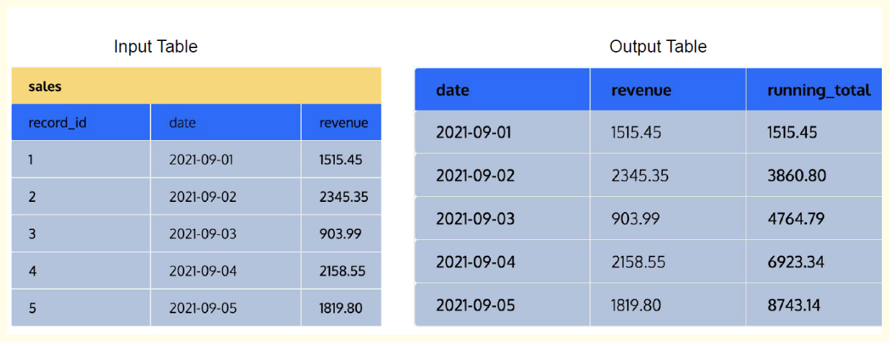

###### Frame Clause

The frame clause in window functions defines the subset of rows ('frame') used for calculating the result of the function for the current row.

It's specified within the OVER() clause after PARTITION BY and ORDER BY.

The frame is defined by two parts: a start and an end, each relative to the current row.

Generic syntax for a window function with a frame clause:
	function_name (expression) OVER (
	[PARTITION BY column_name_1, ..., column_name_n]
	[ORDER BY column_name_1 [ASC | DESC], ..., column_name_n [ASC | DESC]]
	[ROWS|RANGE frame_start TO frame_end]
	)

The frame start can be:
 1. UNBOUNDED PRECEDING (starts at the first row of the partition)
 2. N PRECEDING (starts N rows before the current row)
 3. CURRENT ROW (starts at the current row)

The frame end can be:
 1. UNBOUNDED FOLLOWING (ends at the last row of the partition)
 2. N FOLLOWING (ends N rows after the current row)
 3. CURRENT ROW (ends at the current row)

For ROWS, the frame consists of N rows coming before or after the current row.

For RANGE, the frame consists of rows within a certain value range relative to the value in the current row.

ROWS BETWEEN Example:

	SELECT date, revenue,
	SUM(revenue) OVER (
	ORDER BY date
	ROWS BETWEEN UNBOUNDED PRECEDING AND CURRENT ROW) running_total
	FROM sales
	ORDER BY date;

RANGE BETWEEN Example:

	SELECT
	shop,
	date,
	revenue_amount,
	MAX(revenue_amount) OVER (
	ORDER BY DATE
	RANGE BETWEEN INTERVAL '3' DAY PRECEDING
	AND INTERVAL '1' DAY FOLLOWING
	) AS max_revenue
	FROM revenue_per_shop;