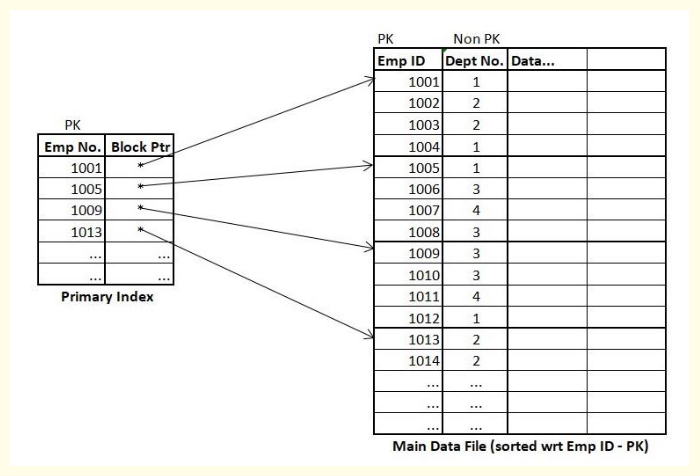

#### Indexing
Indexing in databases involves creating a data structure that improves the speed of data retrieval operations on a database table.

Indexes are used to quickly locate data without having to search every row in a table each time a database table is accessed.

###### Why is Indexing Important?
Indexes are crucial for enhancing the performance of a database by:

1. Speeding up Query Execution: Indexes reduce the amount of data that needs to be scanned for a query, significantly speeding up
data retrieval operations.
2. Optimizing Search Operations: Indexes help in efficiently searching for records based on the indexed columns.
3. Improving Sorting and Filtering: Indexes assist in sorting and filtering operations by providing a structured way to access data.
4. Enhancing Join Performance: Indexes on join columns improve the performance of join operations between tables.

###### Advantages of Indexing

1. Faster Data Retrieval: Indexes make search queries faster by providing a quick way to locate rows in a table.
2. Efficient Use of Resources: Reduced query execution time translates to more efficient use of CPU and memory resources.
3. Improved Performance for Large Tables: Indexes are particularly beneficial for large tables where full table scans would be
time-consuming.
4. Better Sorting and Filtering: Indexes can improve the performance of ORDER BY, GROUP BY, and WHERE clauses.

###### How to Choose the Right Indexing Column

1. Primary Key and Unique Constraints: Always index columns that are primary keys or have unique constraints, as they uniquely
identify rows.
2. Frequently Used Columns in WHERE Clauses: Index columns that are frequently used in WHERE clauses to filter data.
3. Columns Used in Joins: Index columns that are used in join conditions to speed up join operations.
4. Columns Used in ORDER BY and GROUP BY: Index columns that are used in ORDER BY and GROUP BY clauses for faster sorting
and grouping.
5. Selectivity of the Column: Choose columns with high selectivity (columns with many unique values) to maximize the performance
benefits of the index.