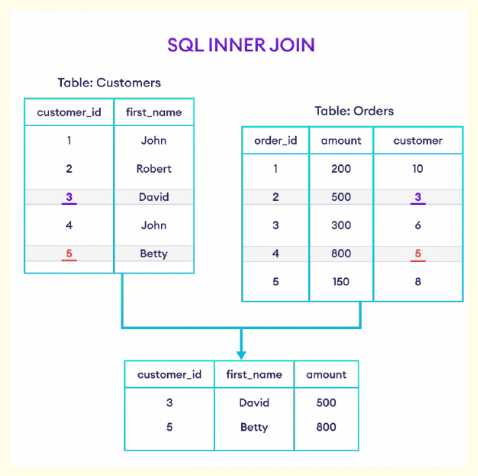
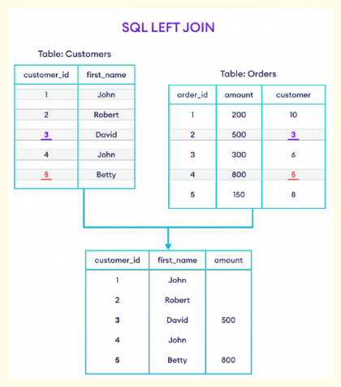
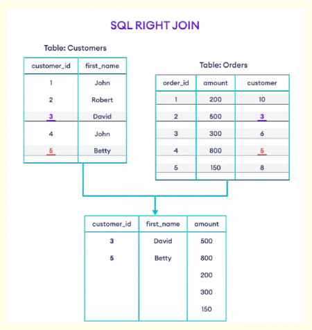
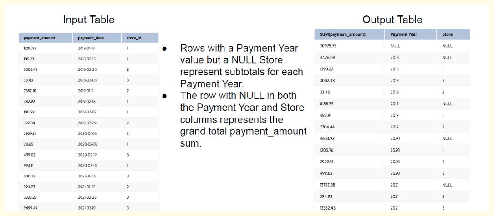

#### JOINS
SQL joins are used to combine rows from two or more tables, based on a related column between them. Here are the main types of SQL joins:

##### Inner Join
Returns records that have matching values in both tables.

	SELECT Customers.customer_id,
	Customers.first_name,
	Orders.amount 
	FROM Customers
	INNER JOIN Orders
	ON Orders.customer = Customers.customer_id;

##### Left Join
Returns all records from the left table (table1), and the matched records from the right table(table2). If no match, the result is NULL on the right side.

	SELECT Customers.customer_id,
	Customers.first_name,
	Orders.amount
	FROM Customers
	LEFT JOIN Orders
	ON Orders.customer = Customers.customer_id;

##### Right Join
Returns all records from the right table (table2), and the matched records from the left table(table1). If no match, the result is NULL on the left side.

	SELECT Customers.customer_id,
	Customers.first_name,
	Orders.amount
	FROM Customers
	RIGHT JOIN Orders
	ON Orders.customer = Customers.customer_id;

##### Full Join
Returns all records when there is a match in either left (table1) or right (table2) table records.

	SELECT Customers.customer_id,
	Customers.first_name,
	Orders.amount
	FROM Customers
	FULL OUTER JOIN Orders
	ON Orders.customer = Customers.customer_id;

##### Cross Join
Returns the Cartesian product of the sets of records from the two or more joined tables when no WHERE clause is used with CROSS JOIN. 

	SELECT Model.car_model,
	Color.color_name
	FROM Model
	Cross JOIN Color;

##### Self Join

A regular join, but the table is joined with itself.

Now, to show the name of the manager for each employee in the same row, we
can run the following query:

	SELECT
	employee.Id,
	employee.FullName,
	employee.ManagerId,
	manager.FullName as ManagerName
	FROM Employees employee
	JOIN Employees manager
	ON employee.ManagerId = manager.Id;

##### Group By WITH ROLLUP

The GROUP BY clause in MySQL is used to group rows that have the same values in specified columns into aggregated data. The WITH ROLLUP option allows you to include extra rows that represent subtotals and grand totals.

	SELECT
	SUM(payment_amount),
	YEAR(payment_date) AS 'Payment Year',
	store_id AS 'Store'
	FROM payment
	GROUP BY YEAR(payment_date), store_id WITH ROLLUP
	ORDER BY YEAR(payment_date), store_id;
