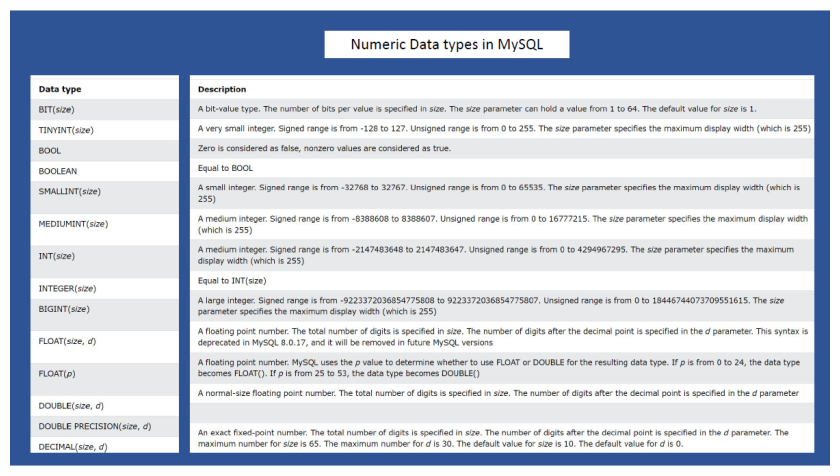

#### What is a database?
Database is structured, organised set of data.Think of it as a filecabinet whre you store data in different sections called tables.

#### Types of Databases

#### What is DBMS?
A software which allows users to interact with data. Stores data in structured format. A schema defines the structure of data.

#### Acid Properties

#### SQL Data Types

#### Types of commands in SQL

1. Data Definition language
2. Data Manipulation language
3. Data Query language
4. Data Control language

#### SQL Constraints

SQL constraints are used to specify rules for the data in a table.
Constraints are used to limit the type of data that can go into a table. This
ensures the accuracy and reliability of the data in the table. If there is any
violation between the constraint and the data action, the action is aborted.
Constraints can be column level or table level.

The following constraints are commonly used in SQL:

1. NOT NULL - Ensures that a column cannot have a NULL value
2. UNIQUE - Ensures that all values in a column are different
3. PRIMARY KEY - A combination of a NOT NULL and UNIQUE. Uniquely identifies each row in a table
4. FOREIGN KEY - Prevents actions that would destroy links between tables
5. CHECK - Ensures that the values in a column satisfies a specific condition
6. DEFAULT - Sets a default value for a column if no value is specified

##### Primary Key

1. Uniqueness: Each primary key value must be unique per table row.
2. Immutable: Primary keys should not change once set.
3. Simplicity: Ideal to keep primary keys as simple as possible.
4. Non-Intelligent: They shouldn't contain meaningful information.
5. Indexed: Primary keys are automatically indexed for faster data retrieval.
6. Referential Integrity: They serve as the basis for foreign keys in other tables.
7. Data Type: Common types are integer or string.

##### Foreign Key
Referential Integrity: Foreign keys link records between tables, maintaining data consistency.
Nullable: Foreign keys can contain null values unless specifically restricted.
Match Primary Keys: Each foreign key value must match a primary key value in the parent table, or be null.
Ensure Relationships: They define the relationship between tables in a database.
No Uniqueness: Foreign keys don't need to be unique.

#### Functions

Functions in MySQL are reusable blocks of code that perform a specific task and return a single value.

Purpose: Simplify complex calculations, enhance code reusability, and improve query performance.

Types: Built-in Functions and User-Defined Functions (UDFs).

1. Built-in Functions

	a. String Functions (e.g., CONCAT, LENGTH, SUBSTRING)

	b. Numeric Functions (e.g., ABS, ROUND, CEIL)

	c. Date and Time Functions (e.g., NOW, DATE_FORMAT, DATEDIFF)
    
	d. Aggregate Functions (e.g., COUNT, SUM, AVG)

2. User-Defined Functions (UDFs) Custom functions created by users to perform specific operations. It is customizable,
reusable, and encapsulate complex logic.

					DELIMITER $$
					CREATE FUNCTION function_name(parameter(s))
					RETURNS data_type
					DETERMINISTIC
					BEGIN
					-- function body
					RETURN value;
					END $$
					DELIMITER ;