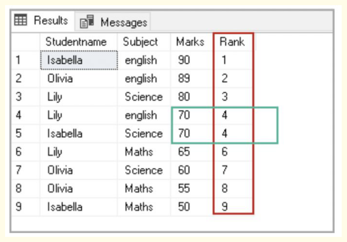
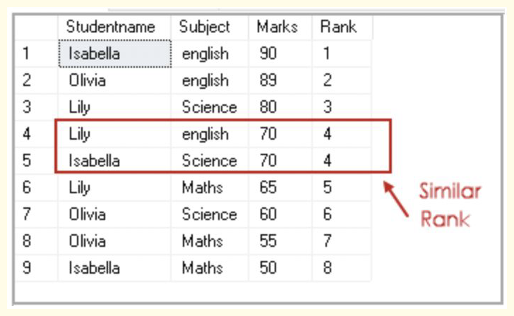
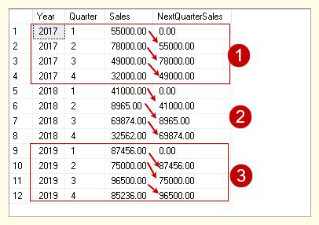

#### Window Functions

1. Window functions: These are special SQL functions that perform a calculation across a set of related rows.
2. How it works: Instead of operating on individual rows, a window function operates on a group or 'window' of rows that are somehow related to the current row. This allows for complex calculations based on these related rows.
3. Window definition: The 'window' in window functions refers to a set of rows. The window can be defined using different criteria depending on the requirements of your operation.
4. Partitions: By using the PARTITION BY clause, you can divide your data into smaller sets or 'partitions'. The window function will then be applied individually to each partition.
5. Order of rows: You can specify the order of rows in each partition using the ORDER BY clause. This order influences how some window functions calculate their result.
6. Frames: The ROWS/RANGE clause lets you further narrow down the window by defining a 'frame' or subset of rows within each partition.
7. Comparison with Aggregate Functions: Unlike aggregate functions that return a single result per group, window functions return a single result for each row of the table based on the group of rows defined in the window.
8. Advantage: Window functions allow for more complex operations that need to take into account not just the current row, but also its 'neighbours' in some way.

	
##### syntax
	function_name (column) OVER (
	[PARTITION BY column_name_1, ..., column_name_n]
	[ORDER BY column_name_1 [ASC | DESC], ..., column_name_n [ASC | DESC]]
	)

1. function_name: This is the window function you want to use. Examples include ROW_NUMBER(), RANK(), DENSE_RANK(), SUM(), AVG(), and many others.
2. (column): This is the column that the window function will operate on. For some functions like SUM(salary)
3. OVER (): This is where you define the window. The parentheses after OVER contain the specifications for the window.
4. PARTITION BY column_name_1, ..., column_name_n: This clause divides the result set into partitions upon which the window function will operate independently. For example, if you have PARTITION BY salesperson_id, the window
function will calculate a result for each salesperson independently.
5. ORDER BY column_name_1 [ASC | DESC], ..., column_name_n [ASC | DESC]: This clause specifies the order of the rows in each partition. The window function operates on these rows in the order specified. For example, ORDERBY sales_date DESC will make the window function operate on rows with more recent dates first.

##### Types of Windows Function
There are three main categories of window functions in SQL: Ranking functions, Value functions, and Aggregate functions. Here's a
brief description and example for each:

###### Ranking Functions:
1. ROW_NUMBER(): Assigns a unique row number to each row, ranking start from 1 and keep increasing till the end of last row

	SELECT Studentname,
	Subject,
	Marks,
	ROW_NUMBER() OVER(ORDER BY Marks desc)
	RowNumber
	FROM ExamResult;

2. RANK(): Assigns a rank to each row. Rows with equal values receive the same rank, with the next row receiving a rank which skips the duplicate rankings.

	SELECT Studentname,
	Subject,
	Marks,
	RANK() OVER(ORDER BY Marks DESC) Rank
	FROM ExamResult
	ORDER BY Rank;

3. DENSE_RANK(): Similar to RANK(), but does not skip rankings if there are duplicates.

	SELECT Studentname,
	Subject,
	Marks,
	DENSE_RANK() OVER(ORDER BY Marks DESC) Rank
	FROM ExamResult

###### Value Functions:
These functions perform calculations on the values of the window rows.

1. FIRST_VALUE(): Returns the first value in the window.

	SELECT
	employee_name,
	department,
	hours,
	FIRST_VALUE(employee_name) OVER (
	PARTITION BY department
	ORDER BY hours
	) least_over_time
	FROM
	overtime;

2. LAST_VALUE(): Returns the last value in the window.

	SELECT employee_name, department,salary,
	LAST_VALUE(employee_name)
	OVER (
	PARTITION BY department ORDER BY
	salary
	) as max_salary
	FROM Employee;

3. LAG(): Returns the value of the previous row.

	SELECT
	Year,
	Quarter,
	Sales,
	LAG(Sales, 1, 0) OVER(
	PARTITION BY Year
	ORDER BY Year,Quarter ASC)
	AS NextQuarterSales
	FROM ProductSales;

4. LEAD(): Returns the value of the next row.

	SELECT Year,
	Quarter,
	Sales,
	LEAD(Sales, 1, 0) OVER(
	PARTITION BY Year
	ORDER BY Year,Quarter ASC)
	AS NextQuarterSales
	FROM ProductSales;

###### Aggregation Functions:
 
These functions perform calculations on the values of the window rows.

1. SUM()
2. MIN()
3. MAX()
4. AVG()